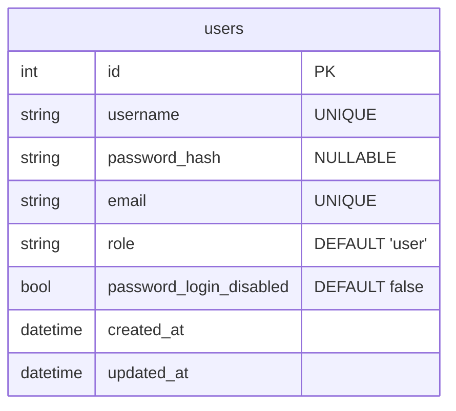
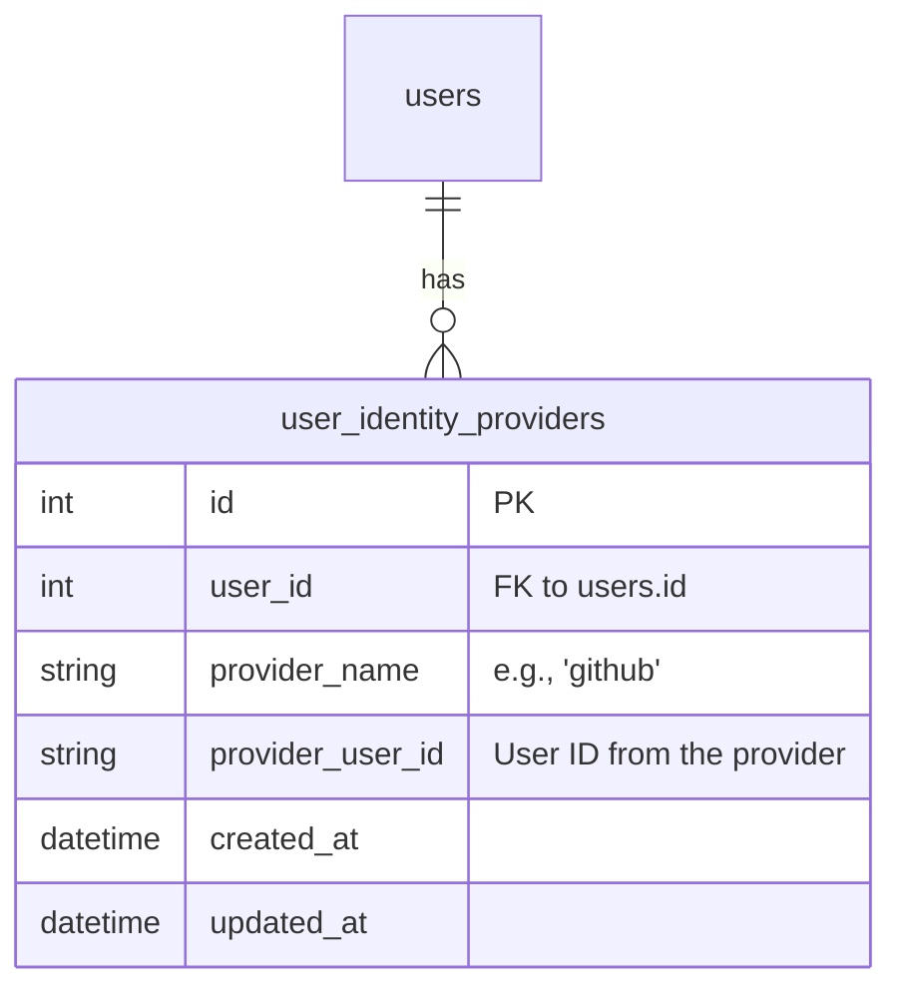
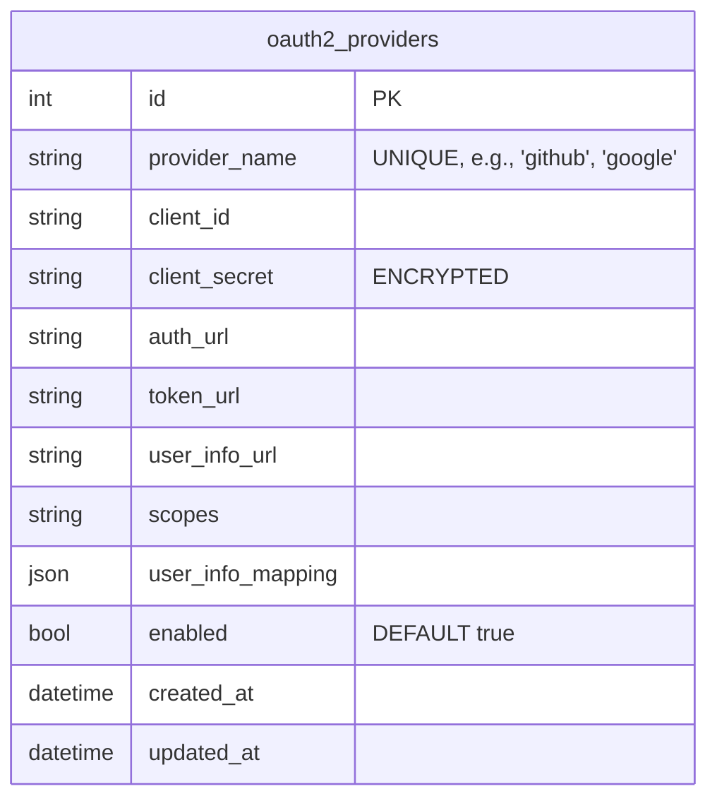
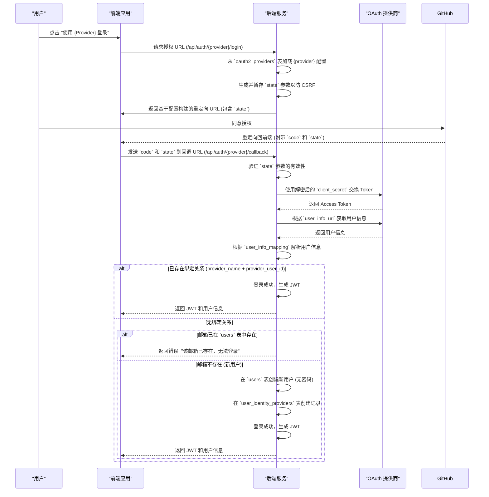

# 项目计划：高级动态认证系统

## 1. 核心目标

构建一个灵活、安全且可扩展的认证系统，该系统：
- 支持标准的密码认证。
- 允许管理员通过 UI 动态配置和管理多个 OAuth 2.0 提供商。
- 支持通过配置好的提供商（如 GitHub）进行第三方登录。
- 允许用户禁用其密码登录，以增强安全性。
- 提供一个安全的管理员后门（命令行工具），用于在服务器上恢复用户的密码登录。
- 自动将系统中的第一个注册用户指定为管理员。

## 2. 数据库设计

### a. `users` 表

扩展 `users` 表以支持新功能。



- **`password_hash`**: 设为 `NULLABLE`，以支持仅使用第三方登录的用户。
- **`role`**: 新增字段，用于权限控制（`user`, `admin`）。
- **`password_login_disabled`**: 新增布尔字段，控制密码登录的可用性。

### b. `user_identity_providers` 表

存储用户与第三方提供商的关联关系。



### c. `oauth2_providers` 表

存储管理员配置的 OAuth 2.0 提供商信息，这是实现动态配置的核心。



- **`client_secret`**: **必须加密存储**，以防止数据库泄露风险。
- **`user_info_mapping`**: JSON 字段，用于动态映射不同提供商返回的用户信息字段，增强了系统的灵活性。

## 3. 后端架构

### a. 动态 OAuth 2.0 登录流程



### b. API 端点

| 方法   | 路径                               | 描述                                                               | 权限     |
| :----- | :--------------------------------- | :----------------------------------------------------------------- | :------- |
| `GET`  | `/api/auth/providers`              | 获取所有已启用的 OAuth 提供商列表。                                | 公开     |
| `GET`  | `/api/auth/{provider}/login`       | 获取指定提供商的授权 URL。                                         | 公开     |
| `GET`  | `/api/auth/{provider}/callback`    | 处理来自任何提供商的回调。                                         | 公开     |
| `POST` | `/api/settings/disable-password`   | 禁用当前用户的密码登录。                                           | 用户认证 |
| `POST` | `/api/settings/enable-password`    | 启用当前用户的密码登录。                                           | 用户认证 |
| `GET`  | `/api/settings/auth-providers`     | 获取用户当前关联的第三方登录提供商。                               | 用户认证 |
| `DELETE`| `/api/settings/auth-providers/{provider}` | 解绑一个第三方提供商（需进行安全检查）。                       | 用户认证 |
| `GET`  | `/api/admin/oauth-providers`       | 获取所有 OAuth 提供商的完整配置列表。                              | 管理员   |
| `POST` | `/api/admin/oauth-providers`       | 新增一个 OAuth 提供商配置。                                        | 管理员   |
| `PUT`  | `/api/admin/oauth-providers/{id}`  | 更新一个 OAuth 提供商配置。                                        | 管理员   |
| `DELETE`| `/api/admin/oauth-providers/{id}` | 删除一个 OAuth 提供商配置。                                        | 管理员   |

### c. 命令行工具

为 `server` 二进制文件添加子命令，用于紧急管理。

```bash
# 强制为指定用户启用密码登录
./server user --enable-password-login <user_email_or_username>
```

## 4. 前端界面

1.  **登录页面:**
    *   动态调用 `/api/auth/providers` 并渲染登录按钮。
2.  **用户设置页面 (`/settings`):**
    *   **安全设置:** 管理密码登录状态。
    *   **关联账户:** 管理绑定的第三方提供商，解绑时进行安全检查（防止孤儿账户）。
3.  **管理员设置页面 (新增):**
    *   提供完整的 CRUD 界面，用于管理 `oauth2_providers`。
    *   表单需要包含所有必要字段，特别是 `user_info_mapping` 的友好输入方式（例如，一个简单的 JSON 编辑器）。

## 5. 实施步骤

1.  **数据库迁移:** 创建迁移文件以应用上述所有数据库变更。
2.  **配置:** 在 `.env` 文件中增加 `APP_ENCRYPTION_KEY` 用于加密 `client_secret`。
3.  **后端实现:**
    *   更新用户模型和服务。
    *   实现通用的、安全的 OAuth 核心逻辑（处理 `state`、加解密、动态映射）。
    *   实现所有新的 API 端点，并应用正确的权限控制。
    *   使用 `clap` 或类似库实现命令行工具。
4.  **前端实现:**
    *   实现动态登录页面。
    *   实现用户设置页面中的新功能。
    *   构建全新的管理员 OAuth 配置页面。
5.  **测试:** 进行全面的端到端和集成测试，覆盖所有安全和业务逻辑。