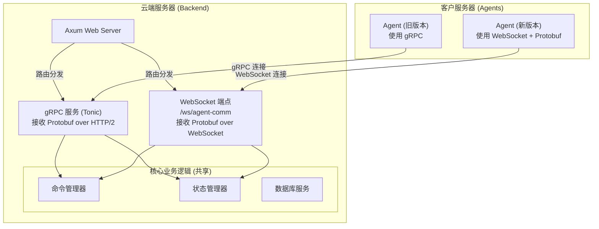

# 架构迁移计划：Agent-Server 通信从 gRPC 迁移到 WebSocket

## 1. 背景

由于 `tonic` gRPC 库存在一个可能导致连接中断的 bug ([issue #515](https://github.com/hyperium/tonic/issues/515))，我们计划将 Agent 与 Server 之间的核心通信协议从 gRPC 双向流迁移到 WebSocket。

为了确保迁移过程的平滑和低风险，我们采用**灰度发布**的“共存方案”，让 Server 在一段时间内同时支持 gRPC 和 WebSocket 两种连接方式。

## 2. 最终方案：Protobuf over WebSocket

我们决定采用 **Protobuf over WebSocket** 的方案。WebSocket 连接将直接传输 Protobuf 序列化后的二进制数据。

**优势**:
*   **高性能**: 保留了 Protobuf 二进制序列化的效率和紧凑性。
*   **代码复用**: 无需定义并行的 JSON 数据结构，Server 和 Agent 的核心代码可以继续使用由 `.proto` 文件生成的类型安全代码。
*   **单一事实来源**: `.proto` 文件继续作为通信协议的唯一事实来源，降低了维护成本和协议不同步的风险。

### 2.1. 改造后架构图

## 3. 分步实施计划

### 第一步：后端核心逻辑抽象

**目标**：将核心业务逻辑与具体的通信层（Tonic Stream vs WebSocket Stream）解耦。

1.  **定义通用 Trait**: 在 `backend/src/server/core_services.rs` 中，定义一个通用的 `trait`，例如 `pub trait AgentStream: Stream<Item = Result<MessageToServer, Status>> + Sink<MessageToAgent, Error = Status> {}`。它抽象了收发 Protobuf 消息的行为。
2.  **重构核心逻辑**: 将 `handle_connection` 的核心逻辑提取到一个新函数 `process_agent_stream`，该函数接收一个实现了 `AgentStream` trait 的泛型参数。

### 第二步：改造 gRPC 服务为适配器

**目标**：将 `tonic` 的 `Stream` 包装成一个实现了我们自定义 `AgentStream` trait 的结构体。

1.  **创建适配器**: 在 `backend/src/server/service.rs` 或一个新模块中，创建一个 `GrpcStreamAdapter` 结构体，它内部持有 `tonic` 的流。
2.  **实现 Trait**: 为 `GrpcStreamAdapter` 实现 `Stream` 和 `Sink`，以及我们自定义的 `AgentStream` trait。这一步的改动会很小，主要是类型包装。
3.  **更新 `handle_connection`**: 简化 `handle_connection`，使其创建 `GrpcStreamAdapter` 实例并调用 `process_agent_stream`。

### 第三步：实现新的 WebSocket 适配器

**目标**：将 `axum` 的 `WebSocket` 连接也包装成一个实现了 `AgentStream` trait 的结构体。

1.  **创建 WebSocket 端点**:
    *   在 `backend/src/http_server/mod.rs` 中，新增路由 `/ws/agent-comm`。
    *   创建新文件 `backend/src/http_server/ws_agent_handler.rs`。
2.  **创建适配器**: 在新 handler 中，创建 `WebSocketStreamAdapter` 结构体。
3.  **实现 Trait**:
    *   为 `WebSocketStreamAdapter` 实现 `Stream`：接收二进制 WebSocket 消息 (`Message::Binary`)，然后使用 `prost::Message::decode()` 将其解码为 `MessageToServer` 结构体。
    *   为 `WebSocketStreamAdapter` 实现 `Sink`：接收 `MessageToAgent` 结构体，使用 `prost::Message::encode_to_vec()` 将其编码为字节，然后作为二进制 WebSocket 消息发送出去。
    *   为 `WebSocketStreamAdapter` 实现 `AgentStream` trait。

### 第四步：改造 Agent 端以支持协议切换

**目标**：让 Agent 可以通过配置选择使用 gRPC 还是 WebSocket，并在选择 WebSocket 时发送二进制 Protobuf 数据。

1.  **添加配置项**: 在 Agent 的配置文件 (`agent.toml`) 中增加一个新字段，如 `protocol = "grpc" | "websocket"`。
2.  **引入新依赖**: 在 `backend/Cargo.toml` 中为 `agent` 添加 `tokio-tungstenite` 依赖。
3.  **实现 WebSocket 客户端**:
    *   创建一个新的通信模块或在现有模块中增加逻辑，用于建立 WebSocket 连接。
    *   在收发消息时，进行 Protobuf 的编码 (`encode_to_vec`) 和解码 (`decode`)。
4.  **协议切换逻辑**: 在 `backend/src/bin/agent.rs` 的 `main` 函数中，根据配置项的值，决定初始化 gRPC 客户端还是 WebSocket 客户端。

## 4. 迁移与弃用

1.  **部署与测试**: 部署改造后的 Server。发布新版 Agent，通过修改配置项，将一小部分 Agent 切换到 WebSocket 协议进行观察和测试。
2.  **逐步推广**: 在确认新方案稳定后，逐步扩大使用 WebSocket 协议的 Agent 范围。
3.  **最终弃用**: 当所有 Agent 都成功迁移到 WebSocket 后，制定一个最终计划，从 Server 和 Agent 代码中彻底移除 gRPC 相关的依赖、路由和逻辑。