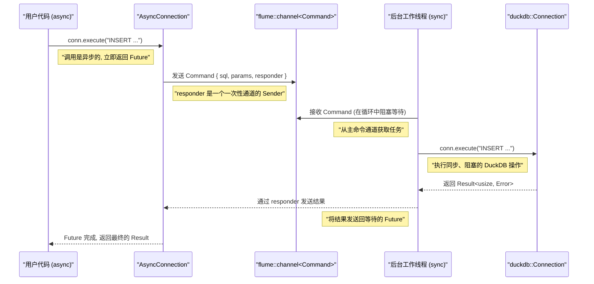

# async-duckdb 详细设计文档

**版本**: 1.0
**目标**: 本文档旨在为 `async-duckdb` crate 提供一份全面、详细的设计蓝图，确保即使在上下文丢失的情况下，开发者也能理解其架构、核心组件、内部逻辑和设计决策。

---

## 1. 概述与目标

`async-duckdb` 是 `duckdb-rs` 的异步封装层，旨在提供一个与现代 Rust 异步生态（如 Tokio, async-std）无缝集成的、高性能的、非阻塞的 DuckDB 客户端。

**核心挑战**: DuckDB 的 C API 是完全同步和阻塞的。直接在异步代码中调用会阻塞整个执行器线程，破坏异步模型的优势。

**核心解决方案**: **将所有同步、阻塞的 DuckDB FFI 调用隔离到一个专用的后台工作线程中**。主应用线程通过异步消息通道与该工作线程通信，从而实现非阻塞的数据库操作。

---

## 2. 核心架构

架构基于一个后台工作线程（Worker）模型，该模型将关注点清晰地分离：

*   **异步前端 (Async Frontend)**: 用户直接交互的接口，如 `AsyncConnection`, `AsyncStatement`。这些接口负责将用户的异步调用转换为发送给 Worker 的消息。
*   **同步后端 (Sync Backend / Worker)**: 一个独立的系统线程，它独占一个同步的 `duckdb::Connection` 实例。它是一个命令处理器，负责执行实际的、阻塞的数据库操作。
*   **通信层 (Communication Layer)**: 使用 `flume` crate 实现的多生产者单消费者（MPSC）通道作为主命令通道，以及用于结果返回的一次性通道。

### 高层流程图



---

## 3. 内部通信协议 (`Command` 枚举)

`Command` 枚举是前后端通信的核心。它定义了所有可以由 Worker 执行的操作。

```rust
// 定义用于返回结果的一次性通道发送端
type Responder<T> = oneshot::Sender<Result<T>>;

// 主命令枚举
enum Command {
    /// 执行一个不返回行的查询
    Execute {
        sql: String,
        params: Vec<duckdb::types::Value>, // 参数已经被转换为有所有权的值
        responder: Responder<usize>,
    },
    /// 准备一个预编译语句
    Prepare {
        sql: String,
        responder: Responder<StatementId>, // 返回一个唯一的 ID
    },
    /// 执行一个已缓存的预编译语句
    ExecuteStatement {
        stmt_id: StatementId,
        params: Vec<duckdb::types::Value>,
        responder: Responder<usize>, // 返回影响的行数
    },
    /// 开始一个流式查询
    QueryStatement {
        stmt_id: StatementId,
        params: Vec<duckdb::types::Value>,
        responder: Responder<QueryId>, // 返回一个查询迭代器的 ID
    },
    /// 从一个已开始的流式查询中获取下一行
    FetchRow {
        query_id: QueryId,
        responder: Responder<Option<OwnedRow>>,
    },
    /// 销毁一个流式查询迭代器
    DropQuery {
        query_id: QueryId,
    },
    /// 销毁一个预编译语句
    DropStatement {
        stmt_id: StatementId,
    },
    /// 开启一个事务
    BeginTransaction {
        responder: Responder<flume::Sender<TransactionCommand>>,
    },
}

// 事务专用命令
enum TransactionCommand {
    // ... 类似于 Command，但没有 BeginTransaction
    // ... 额外包含 Commit 和 Rollback
    Commit { responder: Responder<()> },
    Rollback { responder: Responder<()> },
}

// 类型别名
type StatementId = usize;
type QueryId = usize;
```

---

## 4. 后台工作线程 (Worker) 设计

Worker 是同步后端的核心，它在一个独立的线程上运行。

### Worker 结构体

```rust
struct Worker {
    conn: duckdb::Connection,
    statements: HashMap<StatementId, duckdb::Statement<'static>>,
    queries: HashMap<QueryId, duckdb::Rows<'static>>,
    next_stmt_id: StatementId,
    next_query_id: QueryId,
}
```
*   `conn`: 独占的同步 DuckDB 连接。
*   `statements`: 缓存所有活动的 `duckdb::Statement`。`'static` 生命周期是可行的，因为 `Statement` 的生命周期实际上被 `conn` 的生命周期所覆盖，而 `conn` 和 `statements` 存在于同一个结构体中。
*   `queries`: 缓存所有活动的 `duckdb::Rows` 迭代器，用于流式查询。
*   `next_*_id`: 原子计数器，用于生成唯一的 ID。

### Worker 主循环

Worker 的 `run` 方法是其生命周期的核心。

```rust
// Worker::run(&self, rx: flume::Receiver<Command>)
loop {
    match rx.recv() {
        Ok(Command::Execute { sql, params, responder }) => {
            // ... 执行 conn.execute() ...
            // ... responder.send(result) ...
        },
        Ok(Command::Prepare { sql, responder }) => {
            let stmt = self.conn.prepare(&sql);
            // ... 处理 stmt 的 Result ...
            let id = self.next_stmt_id;
            self.next_stmt_id += 1;
            // 我们需要一种方法来绕过生命周期检查，例如通过 transmute 或将其包装在自引用结构中
            // 或者更安全地，每次使用时都重新 prepare，但这会损失性能。
            // 最终方案：将 statement 和 connection 存储在同一个自引用结构中，如 `ouroboros` crate。
            self.statements.insert(id, unsafe { std::mem::transmute(stmt) });
            responder.send(Ok(id));
        },
        Ok(Command::BeginTransaction { responder }) => {
            // ... 启动事务，创建新通道，并将 sender 返回 ...
            // ... 然后进入一个只监听新通道的子循环 ...
        },
        // ... 处理所有其他 Command 变体 ...
        Err(_) => {
            // 发送端已关闭，意味着 AsyncConnection 被 drop
            // 优雅退出循环
            break;
        }
    }
}
```

---

## 5. 核心异步 API 设计与实现

### `AsyncConnection`

```rust
pub struct AsyncConnection {
    cmd_tx: flume::Sender<Command>,
    // worker_handle: Option<std::thread::JoinHandle<()>>, // 用于 join
}

impl AsyncConnection {
    pub async fn open_in_memory() -> Result<Self> {
        let (cmd_tx, cmd_rx) = flume::unbounded();
        // 启动后台线程
        std::thread::spawn(move || {
            match duckdb::Connection::open_in_memory() {
                Ok(conn) => {
                    let worker = Worker::new(conn);
                    worker.run(cmd_rx);
                },
                Err(e) => { /* 如何通知 open 调用方线程启动失败？
                              可以使用一个 oneshot channel 在 open 时进行同步。*/ }
            }
        });
        Ok(Self { cmd_tx })
    }

    pub async fn execute<S, P>(&self, sql: S, params: P) -> Result<usize>
    where
        S: Into<String> + Send,
        P: IntoParams, // 自定义 Trait
    {
        let (tx, rx) = oneshot::channel();
        self.cmd_tx.send_async(Command::Execute {
            sql: sql.into(),
            params: params.into_params()?,
            responder: tx,
        }).await.map_err(|_| Error::ChannelClosed)?;
        rx.await.map_err(|_| Error::WorkerCrashed)?
    }
    // ... 其他方法 ...
}

impl Drop for AsyncConnection {
    fn drop(&mut self) {
        // 关闭通道会向 Worker 发出退出信号
        // `cmd_tx` 的 drop 会自动关闭通道
    }
}
```

### `AsyncStatement`

```rust
pub struct AsyncStatement<'conn> {
    id: StatementId,
    cmd_tx: flume::Sender<Command>,
    _marker: std::marker::PhantomData<&'conn ()>,
}

impl Drop for AsyncStatement<'_> {
    fn drop(&mut self) {
        // 发送一个 "fire and forget" 的指令
        let _ = self.cmd_tx.send(Command::DropStatement { id: self.id });
    }
}
```

### `OwnedRow` 与 `RowStream`

```rust
// 可以安全地在线程间传递
pub struct OwnedRow {
    values: Vec<duckdb::types::Value>,
}

impl OwnedRow {
    pub fn get<T: duckdb::types::FromSql>(&self, idx: usize) -> duckdb::Result<T> {
        // ... 从 self.values[idx] 转换 ...
    }
}

// Stream 实现
pub struct RowStream<'conn> {
    query_id: QueryId,
    cmd_tx: flume::Sender<Command>,
    _marker: std::marker::PhantomData<&'conn ()>,
}

impl futures::Stream for RowStream<'_> {
    type Item = Result<OwnedRow>;

    fn poll_next(self: Pin<&mut Self>, cx: &mut Context<'_>) -> Poll<Option<Self::Item>> {
        // ... 发送 FetchRow 指令并等待结果 ...
        // 这是一个复杂的实现，需要将 Future 映射到 Poll 状态
    }
}
```

---

## 6. 错误处理机制

*   **`Error::DuckDB(duckdb::Error)`**: 在 Worker 线程中，任何来自 `duckdb::Connection` 或 `duckdb::Statement` 的 `Err` 结果都会被捕获，并通过 `Responder` 原样发送回前端。
*   **`Error::WorkerCrashed`**: 当 `oneshot::Receiver` 在等待结果时返回 `Err(RecvError)`，这表示 `Sender` 端（在 Worker 中）已经被销毁，通常是因为线程 panic。
*   **`Error::ChannelClosed`**: 当 `flume::Sender::send_async` 返回 `Err` 时，表示 `Receiver` 端（在 Worker 中）已经被销毁。这通常是 `WorkerCrashed` 的另一种表现形式。

---

## 7. Rust 特性应用与优化

*   **API 人体工程学**: 广泛使用泛型和 `Into<T>` Trait，使用户可以方便地传入 `&str` 或 `String`。
*   **自动化资源管理 (RAII)**: 严格利用 `Drop` Trait。所有异步句柄在离开作用域时都会自动发送清理指令，确保无资源泄漏。
*   **性能优化**: `OwnedRow` 直接使用 `Vec<duckdb::types::Value>`。`duckdb::types::Value` 对大块数据（如字符串、二进制）使用 `Arc` 或 `Box`，避免了不必要的深拷贝。
*   **代码结构**: 可选地使用 `async-trait` 来定义通用的 `AsyncQueryExecutor` Trait，由 `AsyncConnection` 和 `AsyncTransaction` 共同实现。
*   **内部通信**: 使用 `tokio::sync::oneshot` 或 `flume::bounded(1)` 作为高效的一次性结果返回通道。

---

## 8. 连接池集成 (`deadpool-duckdb`)

为了在生产环境中高效地管理连接，我们将通过创建一个新的 `deadpool-duckdb` crate 来与 `deadpool` 连接池库集成。

### `Manager` Trait 实现
`deadpool` 的核心是 `Manager` trait。我们将为 `async-duckdb` 实现此 trait。

**1. Manager 结构体**
该结构体持有创建 `AsyncConnection` 所需的配置。
```rust
pub enum DuckDBConfig {
    Path(String),
    InMemory,
}

pub struct Manager {
    config: DuckDBConfig,
}

impl Manager {
    pub fn new(config: DuckDBConfig) -> Self {
        Self { config }
    }
}
```

**2. `Manager` Trait 实现**
```rust
use async_duckdb::{AsyncConnection, Error as AsyncError};
use deadpool::managed::{self, RecycleResult};
use async_trait::async_trait;

#[async_trait]
impl managed::Manager for Manager {
    type Type = AsyncConnection;
    type Error = AsyncError;

    // 创建一个新连接
    async fn create(&self) -> Result<Self::Type, Self::Error> {
        match &self.config {
            DuckDBConfig::Path(path) => AsyncConnection::open(path).await,
            DuckDBConfig::InMemory => AsyncConnection::open_in_memory().await,
        }
    }

    // 回收并检查连接健康状况
    async fn recycle(&self, conn: &mut Self::Type) -> RecycleResult<Self::Error> {
        // 发送一个轻量级的 "ping" 查询来验证后台线程是否仍在响应。
        // `PRAGMA version` 是一个理想的选择。
        match conn.execute("PRAGMA version", []).await {
            Ok(_) => Ok(()),
            Err(e) => Err(managed::RecycleError::Backend(e)),
        }
    }

    // 从池中移除连接时的操作
    fn detach(&self, _conn: &mut Self::Type) {
        // 无需任何操作。AsyncConnection 的 Drop 实现会自动处理后台线程的清理。
    }
}
```

### 使用示例
通过导出的类型别名，用户可以轻松构建和使用连接池。
```rust
// 在 deadpool-duckdb crate 中导出
pub type Pool = deadpool::managed::Pool<Manager>;
pub type Connection = deadpool::managed::Object<Manager>;

// 用户代码
async fn main() {
    let config = DuckDBConfig::Path("my-database.db".to_string());
    let manager = Manager::new(config);
    let pool = Pool::builder(manager).max_size(16).build().unwrap();

    // 从池中获取一个连接
    let mut conn = pool.get().await.unwrap();

    // conn 是一个智能指针，Deref 到 AsyncConnection
    conn.execute("CREATE TABLE foo (id INTEGER)", []).await.unwrap();

    // 当 conn 离开作用域时，它会被自动归还到池中并进行 recycle 检查
}
```

---

## 9. 工程实践与质量保障

为了确保 `async-duckdb` 库的健壮性、易用性和可维护性，我们规划了以下工程实践。

### 运行时兼容性
本库的核心设计（`std::thread` + `flume`）不依赖于任何特定的异步运行时。这意味着它应该能同时在 `tokio` 和 `async-std` 等主流运行时上工作。
*   **目标**: 官方支持 `tokio` 和 `async-std`。
*   **实施**: 在持续集成（CI）流程中，为这两种运行时分别设置测试矩阵，确保所有测试都能通过。

### 参数传递 (`IntoParams` Trait)
为了提供与 `duckdb-rs` 高度一致的、符合人体工程学的参数传递体验，我们将定义一个 `IntoParams` trait。
*   **目标**: 允许用户使用 `params!` 宏或类似 `[&dyn ToSql]` 的切片来传递参数。
*   **设计**:
    ```rust
    pub trait IntoParams {
        // 此方法负责将用户提供的各种参数类型转换为 Vec<duckdb::types::Value>
        // 以便能安全地发送到后台线程。
        fn into_params(self) -> Result<Vec<duckdb::types::Value>>;
    }

    // 为 duckdb::Params 的实现者提供 blanket implementation
    impl<P: duckdb::Params> IntoParams for P {
        fn into_params(self) -> Result<Vec<duckdb::types::Value>> {
            // 内部逻辑：迭代 P，将每个 ToSql 转换为拥有的 Value
            // ...
        }
    }
    ```

### 文档与示例
高质量的文档是项目成功的关键。
*   **API 文档**: 所有公开的 `struct`, `enum`, `fn`, 和 `trait` 都必须有详细的 Rustdoc 注释，解释其功能、用法和注意事项。
*   **Crate 级文档**: 在 `lib.rs` 的顶部提供一个全面的指南，包括：
    *   快速上手示例。
    *   关于后台线程模型的简要说明。
    *   连接池的使用方法。
*   **`examples` 目录**: 提供一组可独立运行的示例代码 (`cargo run --example <name>`)，覆盖核心用例：
    *   `basic.rs`: 连接数据库、执行简单查询。
    *   `transaction.rs`: 演示如何正确使用事务，包括提交和回滚。
    *   `streaming.rs`: 演示如何使用 `RowStream` 高效处理大量数据。
    *   `deadpool_integration.rs`: 演示如何配置和使用 `deadpool-duckdb` 连接池。

---

## 10. 未来展望

*   **更多 DuckDB 特性**: 逐步封装更多 DuckDB 的高级功能，如 UDF、表函数等。