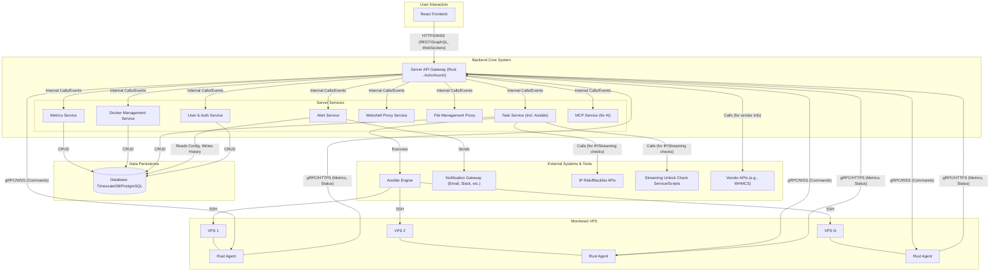
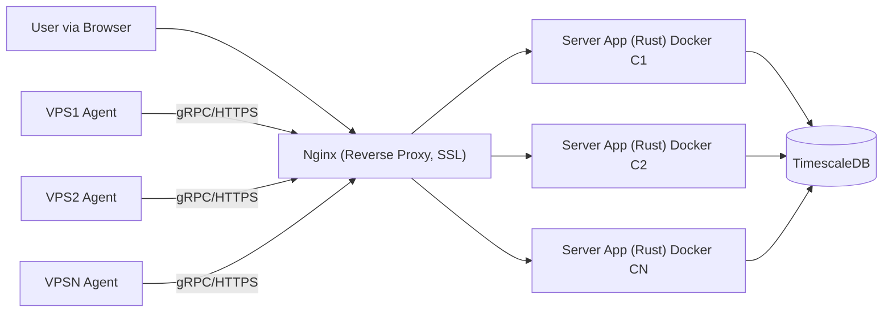

**VPS 监控管理平台 - 架构设计文档**

**目录**

- [1. 引言](#1-引言)
  - [1.1. 项目背景与目标](#11-项目背景与目标)
  - [1.2. 设计原则](#12-设计原则)
  - [1.3. 范围](#13-范围)
  - [1.4. 读者](#14-读者)
- [2. 系统架构概览](#2-系统架构概览)
  - [2.1. 逻辑架构图](#21-逻辑架构图)
  - [2.2. 组件说明](#22-组件说明)
- [3. 组件详细设计](#3-组件详细设计)
  - [3.1. Agent (客户端)](#31-agent-客户端)
  - [3.2. Server (服务端)](#32-server-服务端)
  - [3.3. Frontend (前端)](#33-frontend-前端)
  - [3.4. Database (数据库)](#34-database-数据库)
  - [3.5. Message Queue (消息队列 - 可选/后期引入)](#35-message-queue-消息队列---可选后期引入)
- [4. 数据模型设计](#4-数据模型设计)
  - [4.1. 核心实体](#41-核心实体)
  - [4.2. 主要数据表 (示例 - TimescaleDB/PostgreSQL)](#42-主要数据表-示例---timescaledbpostgresql)
- [5. 接口设计](#5-接口设计)
  - [5.1. Agent \<-\> Server 通信](#51-agent---server-通信)
  - [5.2. Frontend \<-\> Server API](#52-frontend---server-api)
  - [5.3. MCP Server API (AI 客户端)](#53-mcp-server-api-ai-客户端)
- [6. 技术栈](#6-技术栈)
- [7. 部署架构 (初步设想)](#7-部署架构-初步设想)
- [8. 关键特性与设计决策](#8-关键特性与设计决策)
  - [8.1. 实时性](#81-实时性)
  - [8.2. 历史数据存储与查询](#82-历史数据存储与查询)
  - [8.3. 任务系统与 Ansible 集成](#83-任务系统与-ansible-集成)
  - [8.4. Webshell 与文件管理](#84-webshell-与文件管理)
  - [8.5. 安全性](#85-安全性)
  - [8.6. 轻量化与资源占用](#86-轻量化与资源占用)
- [9. 非功能性需求](#9-非功能性需求)
  - [9.1. 性能](#91-性能)
  - [9.2. 可伸缩性](#92-可伸缩性)
  - [9.3. 可靠性](#93-可靠性)
  - [9.4. 可维护性](#94-可维护性)
- [10. 未来展望与扩展点](#10-未来展望与扩展点)

---

## 1. 引言

### 1.1. 项目背景与目标

本项目旨在开发一款基于 Rust 后端和 React 前端的 VPS (Virtual Private Server) 监控管理软件。目标是为用户提供一个集中、高效、轻量级的平台，用于实时监控多台 VPS 的性能指标、管理 VPS 上的 Docker 容器、执行自动化任务、保障服务器安全，并提供便捷的远程管理工具。

### 1.2. 设计原则

*   **高性能与低延迟**: 利用 Rust 的特性保证后端服务的高效处理能力和低延迟响应。
*   **轻量化**: Agent 端和 Server 端尽量减少资源占用，尤其是 Agent 端。
*   **实时性**: 关键性能数据能够实时展示给用户。
*   **可扩展性**: 架构设计应支持未来功能的增加和用户量的增长。
*   **安全性**: 优先考虑数据传输、存储和访问的安全性。
*   **用户友好**: 前端界面直观易用，操作便捷。
*   **模块化**: 组件间低耦合，易于独立开发、测试和维护。

### 1.3. 范围

本文档描述了 VPS 监控管理平台的整体系统架构，包括主要组件、组件间的交互、数据模型、技术选型以及关键设计决策。详细的模块接口设计和数据库表结构将在后续文档中补充。

### 1.4. 读者

本文档主要面向项目开发团队、测试团队以及对系统架构感兴趣的相关人员。

## 2. 系统架构概览

### 2.1. 逻辑架构图

*注：Server Services 可以是同一 Rust 应用内的逻辑模块，也可以根据未来扩展需求拆分为独立微服务。初期建议为逻辑模块。*

### 2.2. 组件说明

*   **React Frontend**: 用户交互界面，负责数据显示、配置管理和操作发起。
*   **Server API Gateway (Rust - Actix/Axum)**:
    *   系统的统一入口，处理所有来自前端和 Agent 的请求。
    *   负责请求路由、认证、授权、参数校验。
    *   聚合后端服务的结果返回给调用方。
*   **Server Services (Rust)**:
    *   **Metrics Service**: 负责接收、处理、存储和查询性能指标数据。
    *   **Docker Management Service**: 负责 Docker 容器信息的收集、存储和管理操作的调度。
    *   **Task Service**: 负责定时任务、一次性任务的管理、调度和执行（包括通过 Ansible）。
    *   **Alert Service**: 负责告警规则的评估、告警事件的生成和通知。
    *   **Webshell Proxy Service**: 代理前端和 Agent 之间的 Webshell 通信。
    *   **File Management Proxy**: 代理前端和 Agent 之间的文件操作。
    *   **User & Auth Service**: 负责用户账户管理、认证和授权。
    *   **MCP Service**: 为 AI 客户端提供交互接口。
*   **Rust Agent**: 部署在被监控 VPS 上的轻量级代理程序。
    *   收集系统性能数据、Docker 信息。
    *   执行来自 Server 的命令 (Ping, 脚本, Docker 操作, Webshell, 文件管理)。
    *   上报数据和状态给 Server。
*   **Database (TimescaleDB/PostgreSQL)**:
    *   存储时序性能数据 (CPU, 内存, IO, 网络等)。
    *   存储关系型数据 (VPS 配置, 用户信息, 任务定义, 告警规则, Docker 元数据等)。
*   **Ansible Engine**: (可选集成) 由 Task Service 调用，用于在 VPS 上执行复杂的配置管理和自动化任务。
*   **Notification Gateway**: 负责将告警信息通过不同渠道 (Email, Slack, Telegram等) 发送给用户。
*   **External APIs/Services**: 用于流媒体解锁检测、IP 风险查询、商家后台数据同步等。

## 3. 组件详细设计

### 3.1. Agent (客户端)

*   **核心职责**: 数据采集、命令执行、与 Server 通信。
*   **技术选型**: Rust。
*   **模块**:
    *   **Collector**: 负责采集各类数据 (系统指标使用 `sysinfo` 或类似库, Docker 指标使用 `bollard`)。支持插件化或可配置采集项。
    *   **Executor**: 负责执行 Server下发的命令 (如 Shell 命令, Docker 命令, 文件操作命令)。
    *   **Communicator**: 负责与 Server 的安全通信 (gRPC 或 HTTPS + MessagePack/CBOR)。实现心跳、数据上报、命令接收。
    *   **Config Manager**: (可选) 从 Server 拉取或本地加载配置。
*   **轻量化措施**:
    *   优化编译选项 (`opt-level='z'`, `lto=true`, `panic='abort'`, `strip=true`)。
    *   精简依赖，使用 feature flags 裁剪不必要功能。
    *   高效的数据序列化 (MessagePack/CBOR 优于 JSON)。
    *   限制本地资源消耗。
*   **安全性**: TLS 加密通信，Token 或证书认证。

### 3.2. Server (服务端)

*   **核心职责**: 数据聚合与处理、API 服务、任务调度、告警管理、用户管理。
*   **技术选型**: Rust (Actix Web 或 Axum)。
*   **主要服务/模块 (逻辑上，初期可在单体应用内实现)**:
    *   **API Gateway**:
        *   使用 Actix Web / Axum。
        *   RESTful API (主要) 或 GraphQL (可选)。
        *   WebSocket 支持 (实时数据推送, Webshell)。
        *   JWT 或类似机制进行认证授权。
    *   **Metrics Service**:
        *   接收 Agent 数据，写入 TimescaleDB。
        *   提供查询接口给前端。
    *   **Task Service**:
        *   使用 `tokio-cron-scheduler` 或自定义调度逻辑。
        *   与 Ansible Engine 通过 `std::process::Command` 交互。
        *   管理任务队列和执行状态。
    *   **Alert Service**:
        *   轮询数据或基于事件触发。
        *   集成通知渠道 (如 `lettre` for email)。
    *   **Webshell/File Management Proxy**:
        *   Websocket 消息中继。
        *   权限校验。
    *   **MCP Service**:
        *   可作为 API Gateway 的一部分，提供专用 gRPC 或 REST 端点。
*   **部署**: 推荐 Docker 容器化部署。

### 3.3. Frontend (前端)

*   **核心职责**: 用户交互、数据可视化、配置管理。
*   **技术选型**: React, TypeScript, Vite。
*   **主要模块/页面**:
    *   Dashboard (VPS 概览)。
    *   VPS 详情页 (实时/历史图表, Docker 管理, 任务, Webshell, 文件管理)。
    *   VPS 管理列表。
    *   任务管理。
    *   告警配置与历史。
    *   用户设置。
*   **状态管理**: Zustand 或 Redux Toolkit。
*   **UI 组件库**: Ant Design, MUI, or Chakra UI。
*   **图表库**: Recharts 或 Nivo。
*   **Webshell**: Xterm.js。

### 3.4. Database (数据库)

*   **技术选型**: **TimescaleDB** (首选，PostgreSQL 扩展)。
*   **数据类型**:
    *   **时序数据**: 性能指标 (CPU, 内存, IO, 网络, Docker 容器指标)。使用 TimescaleDB 的 hypertable。
    *   **关系型数据**: VPS 配置信息, 用户账户, 任务定义, 告警规则, Docker 元数据, IP 检测历史, 流量统计等。
*   **关键设计**:
    *   合理的 hypertable 分区 (`chunk_time_interval`)。
    *   数据保留策略 (Data Retention Policies) 自动清理过期数据。
    *   适当的索引以优化查询性能。
    *   (可选) 数据压缩 (TimescaleDB Compression)。

### 3.5. Message Queue (消息队列 - 可选/后期引入)

*   **技术选型**: NATS (轻量级) 或 RabbitMQ (功能全面)。
*   **用途 (如果引入)**:
    *   解耦 Server 内部服务 (如 Metrics Service -> Alert Service)。
    *   异步处理耗时任务 (如批量执行任务)。
    *   削峰填谷，处理突发数据上报。
*   **初期简化**: 初期可以不引入，通过 Server 内部直接调用或共享状态（如 `tokio::sync::mpsc` channel）实现。

## 4. 数据模型设计

### 4.1. 核心实体

*   `User`: 系统用户。
*   `VPS`: 受监控的虚拟私人服务器。
*   `PerformanceMetric`: VPS 的性能指标记录。
*   `DockerContainer`: VPS 上的 Docker 容器。
*   `DockerMetric`: Docker 容器的性能指标记录。
*   `Task`: 定义的自动化任务。
*   `TaskRun`: 任务的执行记录。
*   `AlertRule`: 用户定义的告警规则。
*   `AlertEvent`: 触发的告警事件记录。
*   `IPCheckResult`: IP 风险或流媒体解锁检测结果。
*   `TrafficRecord`: VPS 流量记录。

### 4.2. 主要数据表 (示例 - TimescaleDB/PostgreSQL)

*   `users (id, username, password_hash, email, created_at, updated_at)`
*   `vps (id, user_id, name, ip_address, os_type, agent_secret, status, metadata jsonb, created_at, updated_at)` (metadata 存商家信息等)
*   `performance_metrics (time TIMESTAMPTZ, vps_id INT, cpu_usage FLOAT, mem_usage FLOAT, disk_io_read BIGINT, disk_io_write BIGINT, net_rx BIGINT, net_tx BIGINT)` (Hypertable)
*   `docker_containers (id, vps_id, container_id_on_host, name, image, status, created_at_on_host, created_at, updated_at)`
*   `docker_metrics (time TIMESTAMPTZ, container_db_id INT, cpu_usage FLOAT, mem_usage FLOAT)` (Hypertable)
*   `tasks (id, user_id, vps_id_target, name, type, schedule_cron, command_payload jsonb, ansible_playbook_path, created_at, updated_at, last_run_at, next_run_at)`
*   `task_runs (id, task_id, status, start_time, end_time, output TEXT)`
*   `alert_rules (id, user_id, vps_id, metric_type, threshold, comparison_operator, duration_seconds, notification_channel, created_at, updated_at)`
*   `alert_events (id, rule_id, vps_id, trigger_time, resolve_time, details TEXT)`
*   `vps_monthly_traffic (vps_id INT, month DATE, total_rx BIGINT, total_tx BIGINT, PRIMARY KEY (vps_id, month))`

## 5. 接口设计

### 5.1. Agent <-> Server 通信

*   **协议**: gRPC (首选) 或 HTTPS + MessagePack/CBOR。
*   **主要接口 (Server 提供, Agent 调用)**:
    *   `RegisterAgent(agent_info) -> agent_id, agent_secret`
    *   `SendHeartbeat(agent_id, status)`
    *   `UploadMetrics(agent_id, metrics_batch)`
    *   `UploadDockerInfo(agent_id, docker_info_batch)`
*   **主要接口 (Agent 提供, Server 调用 - 若使用 gRPC 双向流或 Server 主动连接)**:
    *   `ExecuteCommand(command_request) -> command_response` (用于 Ping, 脚本, Docker 操作)
    *   `StreamPty(pty_stream_request) <-> StreamPty(pty_stream_response)` (Webshell)
    *   `ManageFile(file_op_request) -> file_op_response` (文件管理)

### 5.2. Frontend <-> Server API

*   **协议**: HTTPS + JSON (RESTful API)。WebSocket 用于实时数据和 Webshell。
*   **主要端点 (示例)**:
    *   Auth: `/auth/login`, `/auth/register`, `/auth/me`
    *   VPS: `GET /vps`, `POST /vps`, `GET /vps/{id}`, `PUT /vps/{id}`, `DELETE /vps/{id}`
    *   Metrics: `GET /vps/{id}/metrics/realtime` (WebSocket), `GET /vps/{id}/metrics/historical?start=&end=&granularity=`
    *   Docker: `GET /vps/{id}/docker/containers`, `POST /vps/{id}/docker/containers/{container_id}/start` (etc.)
    *   Tasks: `GET /tasks`, `POST /tasks`, ...
    *   Alerts: `GET /alerts/rules`, `POST /alerts/rules`, ...
    *   Webshell: `WS /vps/{id}/shell`
    *   Files: `GET /vps/{id}/files?path=/`, `POST /vps/{id}/files/upload?path=/`, ...
*   API 文档: 使用 OpenAPI (Swagger) 规范。

### 5.3. MCP Server API (AI 客户端)

*   **协议**: gRPC (推荐) 或结构化的 RESTful API。
*   **接口语义**: 设计为自然语言指令可映射的原子操作。
    *   `GetServerStatus(server_identifier) -> ServerStatusResponse`
    *   `GetServerPerformance(server_identifier, metric_type, time_range) -> PerformanceResponse`
    *   `ExecutePredefinedAction(server_identifier, action_name, parameters) -> ActionResponse` (如重启服务，清理日志)
    *   需要仔细定义 `server_identifier`, `metric_type`, `action_name` 的词汇表和参数。

## 6. 技术栈

(已在之前讨论中详细列出，此处简要回顾核心)

*   **Backend**: Rust, Actix Web / Axum, Tokio, SQLx, Tonic (gRPC).
*   **Frontend**: React, TypeScript, Vite, Zustand/RTK, Axios/React-Query, Recharts/Nivo, Xterm.js.
*   **Database**: TimescaleDB (on PostgreSQL).
*   **Agent**: Rust, sysinfo, bollard, Tonic/reqwest.
*   **Message Queue (可选)**: NATS.
*   **Deployment**: Docker, Docker Compose (Nginx for reverse proxy if needed).

## 7. 部署架构 (初步设想)

*   **Single Server Deployment**:
    *   Server Application (Rust binary) 运行在一个或多个 Docker 容器中。
    *   TimescaleDB 运行在独立的 Docker 容器或专用服务器上。
    *   Nginx (可选) 作为反向代理，处理 SSL 终止和静态文件服务。
    *   Agent 直接安装在被监控的 VPS 上。
*   **Scaled Deployment (未来)**:
    *   Server Application 可以水平扩展多个实例，通过负载均衡器分发请求。
    *   数据库集群 (e.g., Patroni for PostgreSQL high availability).
    *   如果使用消息队列，MQ 集群。

## 8. 关键特性与设计决策

### 8.1. 实时性

通过 WebSocket 将 Server 端聚合的实时数据推送给 Frontend。Agent 上报频率可配置，Server 端对数据进行快速处理和分发。

### 8.2. 历史数据存储与查询

TimescaleDB 的 hypertable 针对时序数据进行了优化，支持高效的范围查询和聚合。数据保留策略管理存储空间。

### 8.3. 任务系统与 Ansible 集成

Task Service 负责调度。对于简单任务，Agent直接执行。对于复杂任务，Task Service 调用 Ansible Engine，利用其强大的配置管理能力。

### 8.4. Webshell 与文件管理

通过 WebSocket (Webshell) 或 REST API (文件管理) 将前端请求代理到 Agent 执行。Server 端负责认证和授权。

### 8.5. 安全性

*   **通信安全**: Agent-Server 和 Frontend-Server 之间使用 TLS/HTTPS/WSS。Agent 与 Server 间可使用共享密钥或客户端证书进行认证。
*   **认证授权**: 前端用户使用 JWT。API 接口进行严格的权限校验。
*   **数据安全**: 敏感配置（如密钥）加密存储或通过安全方式管理。
*   **输入校验**: 对所有外部输入进行严格校验，防止注入等攻击。

### 8.6. 轻量化与资源占用

*   **Agent**: Rust 编译优化，精简依赖，按需加载模块，高效序列化。
*   **Server**: Rust 的高性能特性，异步处理。初期避免引入过多重量级中间件。
*   **数据库**: TimescaleDB 配置优化 (压缩, 保留策略)。

## 9. 非功能性需求

### 9.1. 性能

*   Agent CPU 占用率 < 5% (平均)，内存占用 < 50MB (典型场景)。
*   Server API 响应时间 P95 < 200ms (不含长时间运行任务)。
*   实时数据更新延迟 < 2s。

### 9.2. 可伸缩性

*   Server 端应能通过增加实例进行水平扩展 (stateless or shared state via DB/Cache)。
*   系统应能支持监控数百上千台 VPS。

### 9.3. 可靠性

*   Agent 在网络中断时应能缓存数据，并在恢复后上报。
*   Server 端关键服务应有容错机制。
*   数据库应有备份和恢复策略。

### 9.4. 可维护性

*   代码结构清晰，模块化。
*   良好的日志记录。
*   完善的文档。
*   自动化测试覆盖核心功能。

## 10. 未来展望与扩展点

*   **更丰富的插件生态 (Agent/Server)**: 允许用户自定义监控指标和任务类型。
*   **多租户支持**: 如果需要为不同组织或用户提供隔离的服务。
*   **与更多云平台 API 集成**: 如获取云厂商提供的元数据或计费信息。
*   **基于机器学习的异常检测**: 自动发现性能异常模式。
*   **更高级的 Ansible 集成**: 如 Playbook 仓库管理、可视化编排。
*   **社区版与商业版**: 考虑不同功能集。
