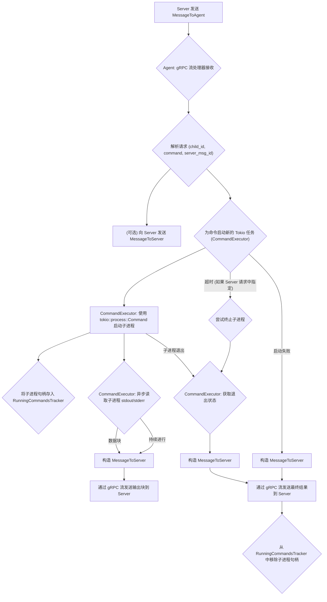
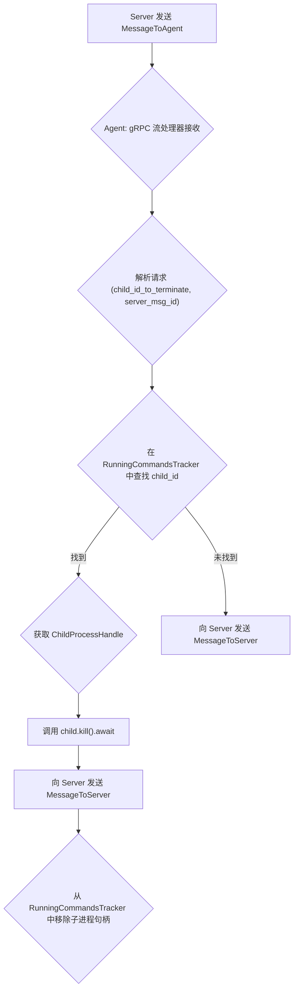

# Server 向 Agent 批量发送指令功能设计文档

## 1. 核心目标

*   允许用户通过 Web UI 选择多个 VPS，并在这些 VPS 上并发执行指定的临时命令或预存脚本。
*   Server 统一管理批量任务的生命周期，包括指令分发、状态跟踪、结果聚合和任务终止。
*   Web UI 实时展示各 VPS 的执行输出和总体任务进展。

## 2. 系统组件交互概览

```mermaid
graph TD
    subgraph Web UI
        A["用户界面: 选择VPS, 输入命令/脚本"] --> B{"发起批量执行请求"};
        B --> C["展示总体任务状态"];
        C --> D["展示各VPS独立输出/状态"];
    end

    subgraph Server
        E["API接口: /api/batch_commands"];
        F["批量任务管理器 BatchCommandManager"];
        G["指令分发服务 CommandDispatcher"];
        H["Agent连接管理器 AgentConnectionManager"];
        I["任务状态存储 TaskStateStore"];
        J["WebSocket服务/长轮询服务 ResultBroadcaster"];
    end

    subgraph Agent (每个VPS一个实例)
        K["指令接收器 CommandReceiver"];
        L["命令执行引擎 CommandExecutor"];
        M["结果/输出发送器 ResultSender"];
    end

    B -- HTTP POST --> E;
    E --> F;
    F -- "创建批量任务, 生成子任务" --> I;
    F -- "请求分发子任务" --> G;
    G -- "获取Agent连接信息" --> H;
    G -- "通过gRPC发送指令" --> K;
    K --> L;
    L -- "执行命令" --> M;
    M -- "实时输出/最终结果" --> G;
    G -- "更新子任务状态/输出" --> I;
    I -- "状态变更通知" --> F;
    F -- "聚合结果, 更新批量任务状态" --> I;
    F -- "推送更新" --> J;
    J -- "WebSocket/HTTP" --> C;
    J -- "WebSocket/HTTP" --> D;

    D -- "用户请求终止单个/全部" --> B;
```

## 3. API 设计

### 3.1. Web UI -> Server (HTTP/HTTPS + WebSocket/Long Polling)

*   **`POST /api/batch_commands`**: 创建并启动一个新的批量命令执行任务。
    *   请求体 (JSON):
        ```json
        {
          "command_content": "your_command_string", // 临时命令内容
          "script_id": "your_saved_script_id",   // 或者预存脚本ID (二选一)
          "working_directory": "/optional/path", // 可选
          "target_vps_ids": ["vps_id_1", "vps_id_2", ...], // 目标VPS的ID列表
          "execution_alias": "Optional friendly name for this batch task" // 可选，方便用户识别
        }
        ```
    *   成功响应 (JSON, HTTP 202 Accepted):
        ```json
        {
          "batch_command_id": "unique_batch_task_uuid",
          "status": "PENDING", // 或 "ACCEPTED"
          "message": "Batch command task accepted and is being processed."
        }
        ```
*   **`GET /api/batch_commands/{batch_command_id}`**: 获取特定批量任务的当前状态和所有子任务的详细信息（用于轮询更新，如果未使用 WebSocket）。
    *   响应体 (JSON):
        ```json
        {
          "batch_command_id": "batch_uuid_123",
          "overall_status": "IN_PROGRESS", // PENDING, IN_PROGRESS, COMPLETED_WITH_ERRORS, COMPLETED_SUCCESSFULLY, TERMINATED
          "execution_alias": "My Batch Task",
          "tasks": [
            {
              "child_command_id": "child_uuid_abc",
              "vps_id": "vps_id_1",
              "vps_name": "Server A",
              "status": "EXECUTING", // PENDING, SENT_TO_AGENT, EXECUTING, SUCCESS, FAILURE, TERMINATED, AGENT_UNREACHABLE
              "exit_code": null,
              "output_stream_summary": ["line 1 from Server A...", "..."], // 最新或摘要输出
              "error_message": null,
              "created_at": "timestamp",
              "updated_at": "timestamp"
            }
            // ... 其他 VPS 的任务状态
          ]
        }
        ```
*   **`POST /api/batch_commands/{batch_command_id}/terminate`**: 终止整个批量任务。
*   **`POST /api/batch_commands/{batch_command_id}/tasks/{child_command_id}/terminate`**: 终止批量任务中的某个特定子任务。

### 3.2. Server <-> Agent (gRPC 双向流)

参见下面的 Protobuf 定义。

## 4. Protobuf 定义 (用于 gRPC 和消息结构)

```protobuf
syntax = "proto3";

package agent_service; // Corrected package name

// Note: The actual .proto files are structured as follows:
// - batch_command.proto: Defines BatchAgentCommandRequest, BatchTerminateCommandRequest, BatchCommandOutputStream, BatchCommandResult, and related enums (CommandType, OutputType, CommandStatus).
// - messages.proto: Defines MessageToServer and MessageToAgent, which use a oneof payload to carry various message types, including those from batch_command.proto. It imports batch_command.proto.
// - service.proto: Defines AgentCommunicationService and its EstablishCommunicationStream RPC, which uses MessageToServer and MessageToAgent. It imports messages.proto.

// For clarity in this design document, we'll show the key batch-related messages and how they fit into the overall communication structure.

// Enums (as defined in batch_command.proto, used by batch messages)
enum CommandType {
  COMMAND_TYPE_UNSPECIFIED = 0;
  ADHOC_COMMAND = 1;
  SAVED_SCRIPT = 2;
}

enum OutputType {
  OUTPUT_TYPE_UNSPECIFIED = 0;
  STDOUT = 1;
  STDERR = 2;
}

enum CommandStatus {
  COMMAND_STATUS_UNSPECIFIED = 0;
  SUCCESS = 1;
  FAILURE = 2;
  TERMINATED = 3;
}

// --- Batch Command Specific Messages (defined in batch_command.proto) ---
// These are encapsulated within MessageToServer and MessageToAgent payloads.

message BatchAgentCommandRequest {
  string command_id = 1;        // Corresponds to child_command_id from the server's perspective
  CommandType type = 2;
  string content = 3;           // Command string or script content/ID
  string working_directory = 4; // Optional: working directory for the command
}

message BatchTerminateCommandRequest {
  string command_id = 1; // child_command_id of the command to terminate
}

message BatchCommandOutputStream {
  string command_id = 1;    // Corresponds to child_command_id
  OutputType stream_type = 2;
  bytes chunk = 3;          // Chunk of output data (stdout or stderr)
  int64 timestamp = 4;      // Optional: timestamp of when the output was generated
}

message BatchCommandResult {
  string command_id = 1;    // Corresponds to child_command_id
  CommandStatus status = 2;
  int32 exit_code = 3;
  string error_message = 4; // Optional: error message if the command failed or was terminated
}

// --- Top-Level Communication Messages (defined in messages.proto) ---
// These messages are exchanged over the AgentCommunicationService's stream.
// They include other payload types not detailed here for brevity (e.g., handshake, metrics).

message MessageToServer { // Agent sends this to Server
  uint64 client_message_id = 1; // Client-generated ID for the message
  int32 vps_db_id = 9;          // The vps.id from the database (identifies the agent)
  string agent_secret = 10;     // The secret for this specific agent/vps
  // ... other common fields ...

  oneof payload {
    // ... other payload types like AgentHandshake, PerformanceSnapshotBatch, etc. ...
    BatchCommandOutputStream batch_command_output_stream = 13; // Agent sends output chunks
    BatchCommandResult batch_command_result = 14;             // Agent sends final result
    // ... other potential payloads ...
  }
}

message MessageToAgent { // Server sends this to Agent
  uint64 server_message_id = 1; // Server-generated ID for the message
  // ... other common fields ...

  oneof payload {
    // ... other payload types like ServerHandshakeAck, general CommandRequest, etc. ...
    BatchAgentCommandRequest batch_agent_command_request = 8;       // Server sends command to execute
    BatchTerminateCommandRequest batch_terminate_command_request = 9; // Server requests command termination
    // ... other potential payloads ...
  }
}

// --- gRPC Service Definition (defined in service.proto) ---
// This single service handles all general communication between Server and Agent.
service AgentCommunicationService {
  // Establishes a bi-directional stream for ongoing communication.
  // All interactions, including batch commands (requests, output, results, termination),
  // are performed by sending MessageToServer and MessageToAgent messages over this stream,
  // with the specific action determined by the 'payload' oneof field.
  rpc EstablishCommunicationStream(stream MessageToServer) returns (stream MessageToAgent);
}
```

## 5. 数据结构 (Server 端)

*   **BatchCommandTask**:
    *   `batch_command_id` (PK, UUID)
    *   `original_request_payload` (JSON, 存储原始请求体)
    *   `status` (String: PENDING, IN_PROGRESS, COMPLETED_SUCCESSFULLY, COMPLETED_WITH_ERRORS, TERMINATED, FAILED_TO_START)
    *   `execution_alias` (String, 可选，用户友好名称)
    *   `user_id` (String, 发起用户ID)
    *   `created_at` (Timestamp)
    *   `updated_at` (Timestamp)
    *   `completed_at` (Timestamp, 可选)

*   **ChildCommandTask**:
    *   `child_command_id` (PK, UUID)
    *   `batch_command_id` (FK, UUID, 索引)
    *   `vps_id` (String, 索引)
    *   `status` (String: PENDING, SENT_TO_AGENT, AGENT_ACCEPTED, EXECUTING, SUCCESS, FAILURE, TERMINATED, AGENT_UNREACHABLE, AGENT_REJECTED)
    *   `exit_code` (Integer, 可选)
    *   `error_message` (Text, 可选)
    *   `stdout_log_path` (String, 可选，如果输出量大，存文件路径)
    *   `stderr_log_path` (String, 可选)
    *   `last_output_at` (Timestamp, 可选，用于判断无输出超时)
    *   `created_at` (Timestamp)
    *   `updated_at` (Timestamp)
    *   `agent_started_at` (Timestamp, 可选)
    *   `agent_completed_at` (Timestamp, 可选)

## 6. 核心流程 (Server 端)

### 6.1. 批量任务创建与分发
1.  Web UI 发送 `POST /api/batch_commands` 请求。
2.  Server API 接收请求，进行参数校验（如 `target_vps_ids` 是否有效，`command_content` 和 `script_id` 是否互斥等）。
3.  `BatchCommandManager` 创建 `BatchCommandTask` 记录，初始状态为 `PENDING`。
4.  为 `target_vps_ids` 中的每个 `vps_id`：
    *   创建 `ChildCommandTask` 记录，状态为 `PENDING`，并关联到 `BatchCommandTask`。
5.  `BatchCommandManager` 将所有子任务信息异步地传递给 `CommandDispatcher`（例如通过消息队列或内部事件）。
6.  `CommandDispatcher` 逐个处理子任务：
    *   查询 `AgentConnectionManager` 获取目标 `vps_id` 对应的 Agent 的 gRPC 连接。
    *   如果 Agent 未连接或连接无效，更新 `ChildCommandTask` 状态为 `AGENT_UNREACHABLE`。
    *   如果 Agent 已连接，通过 gRPC 流向 Agent 发送 `MessageToAgent` (其 payload 为 `BatchAgentCommandRequest`，其中包含 `child_command_id`)。
    *   更新 `ChildCommandTask` 状态为 `SENT_TO_AGENT`。
7.  `BatchCommandManager` 在所有子任务初步处理（尝试发送或标记为不可达）后，更新 `BatchCommandTask` 状态为 `IN_PROGRESS` (如果至少有一个子任务成功发送或正在尝试)。如果所有子任务都 `AGENT_UNREACHABLE`，则标记为 `FAILED_TO_START`。

### 6.2. Agent 执行与反馈 (Server 视角)
1.  Agent 的 gRPC `EstablishCommunicationStream` 方法被调用，通过流接收 `MessageToAgent`。
2.  当收到 `MessageToAgent` 其 payload 为 `BatchAgentCommandRequest`：
    *   Agent `CommandReceiver` 解析指令。
    *   Agent 可以先向 Server 发送一个确认消息（例如自定义的 `AgentAcceptedMessage`，包含 `child_command_id`），Server 端可更新 `ChildCommandTask` 状态为 `AGENT_ACCEPTED`。 (或者通过 `MessageToServer` 发送一个特定的 `BatchCommandResult` 状态)
    *   Agent `CommandExecutor` 启动命令执行进程（例如，在新的线程或子进程中）。
    *   更新 `ChildCommandTask` 状态（通过 Server 反馈）为 `EXECUTING`。
3.  实时捕获命令的标准输出 (stdout) 和标准错误 (stderr)。
4.  `ResultSender` 将捕获到的输出分块封装成 `BatchCommandOutputStream`，通过 gRPC 流发送回 Server (封装在 `MessageToServer` 的 payload 中)。
5.  命令执行完毕后，获取退出码和任何错误信息，封装成 `BatchCommandResult`，通过 gRPC 流发送回 Server (封装在 `MessageToServer` 的 payload 中)。
6.  如果 Agent 收到 `MessageToAgent` 其 payload 为 `BatchTerminateCommandRequest`：
    *   尝试终止对应的命令执行进程 (e.g., `SIGTERM`, then `SIGKILL`)。
    *   发送 `BatchCommandResult` (状态为 `TERMINATED`) 回 Server (封装在 `MessageToServer` 的 payload 中)。

### 6.3. Server 接收与聚合
1.  Server `CommandDispatcher` (或其 gRPC 服务实现) 通过 gRPC 流接收来自 Agent 的 `MessageToServer`。
2.  根据 `MessageToServer` 的 `payload` 类型处理：
    *   `BatchCommandOutputStream`: 根据 `command_id` (即 `child_command_id`) 找到对应的 `ChildCommandTask`。将输出块追加到日志文件 (如果使用) 或临时存储，并更新 `last_output_at`。
    *   `BatchCommandResult`: 根据 `command_id` 更新 `ChildCommandTask` 的最终状态 (`SUCCESS`, `FAILURE`, `TERMINATED`)、`exit_code`、`error_message` 和 `agent_completed_at`。
    *   (可选) 其他类型的确认消息: 更新 `ChildCommandTask` 状态。
3.  `BatchCommandManager` 定期或在 `ChildCommandTask` 状态更新时检查其关联的所有子任务：
    *   如果所有 `ChildCommandTask` 都已完成 (状态为 `SUCCESS`, `FAILURE`, `TERMINATED`, `AGENT_UNREACHABLE`, `AGENT_REJECTED`)，则更新 `BatchCommandTask` 的最终状态：
        *   如果所有子任务都是 `SUCCESS`，则为 `COMPLETED_SUCCESSFULLY`。
        *   否则为 `COMPLETED_WITH_ERRORS`。
    *   更新 `BatchCommandTask` 的 `completed_at` 和 `updated_at`。
4.  `ResultBroadcaster` 将 `ChildCommandTask` 的实时输出和状态更新，以及 `BatchCommandTask` 的整体状态，通过 WebSocket 或其他机制推送给订阅的 Web UI 客户端。

### 6.4. Web UI 展示
1.  Web UI 通过 WebSocket 接收来自 `ResultBroadcaster` 的实时更新，或通过定时轮询 `GET /api/batch_commands/{batch_command_id}` API 获取最新状态。
2.  根据 `batch_command_id` 展示批量任务的总体状态和摘要信息。
3.  为 `tasks` 数组中的每个 `child_command_id` (对应一个 VPS) 展示其独立的输出流（例如在一个可滚动的文本区域）、当前状态、退出码等。

### 6.5. 任务终止
*   **终止整个批量任务**:
    1.  Web UI 发送 `POST /api/batch_commands/{batch_command_id}/terminate`。
    2.  Server `BatchCommandManager` 找到该 `batch_command_id` 下所有未完成的 (`SENT_TO_AGENT`, `AGENT_ACCEPTED`, `EXECUTING`) `ChildCommandTask`。
    3.  为每个此类子任务，通过 `CommandDispatcher` 向对应的 Agent 发送 `MessageToAgent` (其 payload 为 `BatchTerminateCommandRequest`，内含 `child_command_id`)。
    4.  更新这些 `ChildCommandTask` 的状态为尝试终止 (e.g., `TERMINATING`)。
    5.  `BatchCommandTask` 状态也更新为 `TERMINATING`。后续 Agent 返回 `TERMINATED` 状态后，再最终确定状态。
*   **终止单个子任务**:
    1.  Web UI 发送 `POST /api/batch_commands/{batch_command_id}/tasks/{child_command_id}/terminate`。
    2.  Server `BatchCommandManager` 找到指定的 `child_command_id`，如果其未完成，则向对应 Agent 发送 `MessageToAgent` (其 payload 为 `BatchTerminateCommandRequest`)。
    3.  更新该 `ChildCommandTask` 状态。

## 7. Agent 端批量命令处理设计方案

### 7.1. 核心目标 (Agent)

Agent 需要能够可靠地执行 Server 通过 gRPC 双向流发送的命令，并满足以下要求：
*   **接收与解析**: 正确接收并解析来自 Server 的 `MessageToAgent` (payload 为 `BatchAgentCommandRequest`)。
*   **异步执行**: 以非阻塞方式执行命令。
*   **实时输出**: 将命令的 `stdout` 和 `stderr` 实时流式传输回 Server (通过 `MessageToServer` 封装 `BatchCommandOutputStream`)。
*   **状态报告**: 命令执行完成后，向 Server 报告最终状态（成功、失败、退出码、错误信息）(通过 `MessageToServer` 封装 `BatchCommandResult`)。
*   **命令终止**: 响应 Server 发送的 `MessageToAgent` (payload 为 `BatchTerminateCommandRequest`)，并尝试终止正在执行的命令。

### 7.2. 关键组件与数据结构 (Agent 端)

*   **gRPC 服务实现 (`AgentCommunicationService` 的 `EstablishCommunicationStream` 方法)**:
    *   处理与 Server 的双向流连接。
    *   循环接收 `MessageToAgent` 消息，并根据 `payload` 类型（`BatchAgentCommandRequest` 或 `BatchTerminateCommandRequest` 等）分发处理。
*   **`CommandExecutor` (逻辑模块/任务)**:
    *   每个 `BatchAgentCommandRequest` 会触发一个独立的异步任务 (`tokio::spawn`)。
    *   负责使用 `tokio::process::Command` 启动和管理子进程。
    *   捕获子进程的 `stdout` 和 `stderr`。
    *   监控子进程的退出状态和超时（如果 Server 请求中指定）。
*   **`RunningCommandsTracker` (状态管理)**:
    *   一个线程安全的数据结构 (例如 `Arc<Mutex<HashMap<String, ChildProcessHandle>>>`)，用于跟踪当前正在执行的命令。
    *   `String` 是 `child_command_id`。
    *   `ChildProcessHandle` 结构体包含：
        ```rust
        struct ChildProcessHandle {
            child: tokio::process::Child, // Tokio 的子进程句柄
            // kill_signal_tx: Option<tokio::sync::oneshot::Sender<()>>, // 可选：用于更优雅的终止信号
        }
        ```

### 7.3. 核心流程 (Agent 端)

#### 7.3.1. 处理 `BatchAgentCommandRequest` (命令执行)



**详细步骤:**
1.  **接收与确认**: Agent 的 gRPC 流处理器接收到 `MessageToAgent`，其 `payload` 为 `BatchAgentCommandRequest`。
2.  Agent 可以选择立即向 Server 发送一个表示“已接受”的 `MessageToServer` (其 `payload` 为 `BatchCommandResult`，例如，使用一个自定义的 `CommandStatus` 或在 Server 端定义 `AGENT_ACCEPTED` 状态)。
3.  **异步执行**: 为该命令启动一个新的 Tokio 任务。
    *   使用 `tokio::process::Command` 配置并启动子进程。
    *   将 `tokio::process::Child` 实例存入 `RunningCommandsTracker`，与 `child_command_id` 关联。
4.  **输出流式传输**:
    *   在执行任务中，异步读取子进程的 `stdout` 和 `stderr`。
    *   每当读取到数据块，构造 `BatchCommandOutputStream` 消息，封装在 `MessageToServer` 的 `payload` 中并发送回 Server。
5.  **超时处理**: 如果 `BatchAgentCommandRequest` 中包含超时信息，启动一个计时器。若超时，则尝试终止命令并发送 `MessageToServer` (其 `payload` 为 `BatchCommandResult`，状态为 `FAILURE`，可附带超时错误信息)。
6.  **完成处理**:
    *   当子进程退出时，获取退出码。
    *   构造 `BatchCommandResult`（`status` 为 `SUCCESS` 或 `FAILURE`），包含 `exit_code` 和错误信息（如果有）。
    *   封装在 `MessageToServer` 的 `payload` 中并发送最终结果给 Server。
7.  **清理**: 命令完成后，从 `RunningCommandsTracker` 中移除该命令的记录。
8.  **Agent 内部错误**: 若在启动或执行过程中 Agent 自身发生错误，发送 `MessageToServer` (其 `payload` 为 `BatchCommandResult`，状态为 `FAILURE`，并附带 Agent 内部错误信息)。

#### 7.3.2. 处理 `BatchTerminateCommandRequest` (命令终止)


**详细步骤:**
1.  **接收请求**: Agent 的 gRPC 流处理器接收到 `MessageToAgent`，其 `payload` 为 `BatchTerminateCommandRequest`。
2.  **查找命令**: 使用 `command_id` (即 `child_command_id`) 在 `RunningCommandsTracker` 中查找对应的 `ChildProcessHandle`。
3.  **执行终止**:
    *   如果找到，调用 `child.kill().await` 来终止子进程。
4.  **状态报告**:
    *   向 Server 发送 `MessageToServer` (其 `payload` 为 `BatchCommandResult`，状态为 `TERMINATED`)。
    *   如果命令未找到（可能已完成或从未启动），也应向 Server 报告 (例如，`MessageToServer` 的 `payload` 为 `BatchCommandResult`，状态为 `FAILURE`，并附带“未找到待终止任务”的错误信息)。
5.  **清理**: 从 `RunningCommandsTracker` 中移除该命令的记录。

### 7.4. 关键考量点 (Agent 端)

*   **并发安全**: `RunningCommandsTracker` 必须是线程安全的。
*   **资源管理**: 确保子进程和相关资源在命令完成或 Agent 关闭时得到妥善清理。
*   **错误处理**: 对各种潜在错误（进程启动失败、管道读取错误、gRPC 通信错误等）进行健壮处理，并向 Server 提供有意义的错误信息。
*   **配置性**: 考虑 Agent 端是否需要某些配置，例如默认的命令执行路径、环境变量等。
*   **安全性**: Agent 执行来自 Server 的命令，需要考虑潜在的安全风险。例如，限制命令执行的权限、验证命令内容等（这部分可能更多在 Server 端进行初步过滤）。

## 8. Server 端组件职责 (回顾)

*   **Web UI**: 用户交互界面，发起请求，展示结果。
*   **API Gateway/Router (Server)**: 接收 HTTP 请求，路由到相应服务。
*   **BatchCommandManager (Server)**: 核心业务逻辑协调者。负责批量任务的创建、生命周期管理、状态聚合、与子任务的协调。
*   **CommandDispatcher (Server)**: 负责将单个指令通过 gRPC 发送给正确的 Agent，并处理来自 Agent 的 gRPC 消息流。
*   **AgentConnectionManager (Server)**: 维护 Server 与所有已连接 Agent 的 gRPC 连接状态和通信句柄/流。
*   **TaskStateStore (Server)**: 数据库接口，用于持久化 `BatchCommandTask` 和 `ChildCommandTask` 的状态。
*   **ResultBroadcaster (Server)**: 负责将任务进展和结果有效地推送给前端 (e.g., WebSocket 管理器)。

## 9. 错误处理与边界情况 (整体)

*   **Agent 不可达/连接断开**: `AgentConnectionManager` 和 `CommandDispatcher` 在尝试发送或在流交互中断时，应将对应的 `ChildCommandTask` 标记为 `AGENT_UNREACHABLE`。gRPC 提供了连接状态回调。
*   **指令发送失败**: 网络问题导致指令未能成功发送给 Agent。
*   **Agent 执行超时/无响应**:
    *   Agent 端可以为命令执行设置一个内部超时。
    *   Server 端可以为 `ChildCommandTask` 设置一个无输出超时 (`last_output_at`)，超时后可尝试发送终止指令或标记为失败。
    *   gRPC Keepalive 机制可以帮助检测死连接。
*   **Agent 崩溃/失联**: Server 端的心跳或 gRPC 连接状态会检测到，相关任务标记为 `AGENT_UNREACHABLE` 或 `FAILURE`。
*   **部分成功，部分失败**: `BatchCommandTask` 的最终状态应为 `COMPLETED_WITH_ERRORS`。
*   **输出量过大**:
    *   gRPC 流支持分块传输。
    *   Agent 端和 Server 端在处理输出流时应注意内存管理。
    *   如前述，将详细日志存储到文件，API/WebSocket 只推送摘要或最新部分，Web UI 提供下载完整日志的选项。
*   **gRPC 流错误**: gRPC 本身会处理流级别的错误，双方需要正确处理这些错误状态。
*   **数据库操作失败**: Server 端在更新任务状态时需处理数据库事务和可能的失败。

## 10. (可选) 未来可扩展功能

*   **失败重试机制**: 对标记为 `AGENT_UNREACHABLE` 或特定类型 `FAILURE` 的子任务，允许用户手动或配置自动重试策略。
*   **任务队列与优先级**: 如果并发任务过多，引入持久化任务队列 (e.g., Redis, RabbitMQ)，并允许设置任务优先级。
*   **脚本管理增强**: 更完善的脚本存储、版本控制、参数化脚本、脚本共享等。
*   **审计日志**: 详细记录所有批量操作的请求、执行者、目标、时间、结果等，用于审计和追踪。
*   **权限控制**: 基于角色的访问控制 (RBAC)，细化哪些用户可以对哪些 VPS 分组执行哪些命令/脚本。
*   **Agent 自我更新/管理**: 通过命令通道下发 Agent 更新指令。
*   **模板化命令**: 支持定义带有占位符的命令模板。