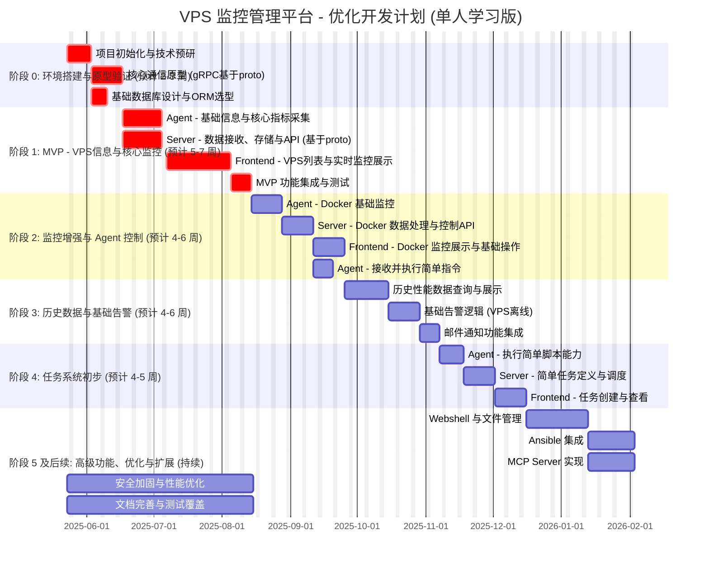

# VPS 监控管理平台 - 优化开发计划 (单人学习版)

## 核心原则：

*   **学习与实践并行**：在实现功能的同时，有意识地学习和应用 Rust 和 React 的相关知识。
*   **MVP 聚焦核心**：首个可交付版本专注于 VPS 基本信息展示和核心指标的实时监控。
*   **迭代与演进**：每个阶段都有明确的可验证成果，并根据实际情况灵活调整。
*   **架构一致性**：尽早并持续地与架构设计文档中的定义（尤其是 [`proto/server.proto`](proto/server.proto:0)）保持一致。

---

## 开发阶段划分及主要任务：

## 详细任务分解：

**阶段 0: 环境搭建与原型验证 (预计 2-3 周)**

*   **目标**：搭建基础开发环境，验证核心技术栈的可行性，特别是基于 [`proto/server.proto`](proto/server.proto:0) 的 Agent-Server gRPC 通信原型。
*   **任务**：
    1.  **项目初始化与技术预研** (7天)
        *   创建 Git 仓库，配置 `.gitignore`。
        *   搭建 Rust 后端项目结构 (如 `cargo new vps_monitor_server --lib` 和 `cargo new vps_monitor_agent`)。
        *   搭建 React 前端项目结构 (Vite + TypeScript)。
        *   学习 Rust 基础、Tokio 异步编程、gRPC (Tonic) 基础。
        *   学习 React 基础、TypeScript、状态管理 (如 Zustand) 基础。
        *   初步调研并选择 Rust Web 框架 (Actix Web 或 Axum，根据架构文档)。
    2.  **核心通信原型 (gRPC 基于 [`proto/server.proto`](proto/server.proto:0))** (10天)
        *   仔细阅读并理解 [`proto/server.proto`](proto/server.proto:0) 中关于 `EstablishCommunicationStream`, `MessageToServer`, `MessageToAgent` 及相关的握手、心跳消息定义。
        *   在 Server 端使用 Tonic 实现 gRPC 服务，处理基础的 `AgentHandshake` 和 `Heartbeat`。
        *   在 Agent 端使用 Tonic 实现 gRPC 客户端，能连接 Server，发送 `AgentHandshake` 和 `Heartbeat`。
        *   实现双向流的基本框架，能够打印收发消息。
        *   *学习重点：Rust gRPC (Tonic), Protocol Buffers, 双向流通信。*
    3.  **基础数据库设计与 ORM 选型** (5天)
        *   根据架构文档 ([`docs/arch_design.md#42-主要数据表-示例---postgresql`](docs/arch_design.md:273))，设计 `users`, `vps` 核心表。
        *   选择并安装 PostgreSQL。
        *   调研 Rust ORM 或 SQL 构建工具 (如 `sqlx`, `diesel`)，并完成基础连接测试。
        *   *学习重点：PostgreSQL 基础, Rust 数据库交互。*

**阶段 1: MVP - VPS 信息与核心监控 (预计 5-7 周)**

*   **目标**：实现 MVP，用户可以添加 VPS，并实时查看其核心性能指标。
*   **任务**：
    1.  **Agent - 基础信息与核心指标采集** (14天)
        *   实现采集 VPS 操作系统信息、主机名等基础信息 (参考 [`AgentHandshake`](proto/server.proto:359) 中可能包含的字段)。
        *   使用 `sysinfo` 或类似库采集：
            *   CPU 使用率 (总览及核心)。
            *   内存使用率 (总内存、已用、可用)。
            *   磁盘空间使用率 (主要挂载点)。
            *   网络流量 (总收发，可能需要区分接口，参考 [`NetworkInterfaceStats`](proto/server.proto:76))。
            *   磁盘 I/O (读/写速率，参考 [`DiskUsage`](proto/server.proto:68) 中可能包含的指标)。
        *   将采集到的数据封装成 [`PerformanceSnapshot`](proto/server.proto:86) 结构。
        *   通过 gRPC 流的 `MessageToServer` (包含 `PerformanceSnapshotBatch`) 发送给 Server。
        *   *学习重点：Rust 系统信息采集, 数据结构化。*
    2.  **Server - 数据接收、存储与 API (基于 [`proto/server.proto`](proto/server.proto:0))** (14天)
        *   扩展 gRPC 服务，接收 Agent 发送的 `PerformanceSnapshotBatch`。
        *   数据校验与初步处理。
        *   将 VPS 基础信息存入 `vps` 表。
        *   将性能数据存入 `performance_metrics` 表 (考虑时序特性，初期可简化)。
        *   实现基础的 RESTful API (使用选定的 Rust Web 框架)：
            *   用户注册/登录 (简单实现)。
            *   `POST /api/vps` (添加 VPS，记录 Agent 关联信息)。
            *   `GET /api/vps` (获取 VPS 列表)。
            *   `GET /api/vps/{id}/metrics/realtime` (准备用于 WebSocket 推送)。
        *   *学习重点：Rust Web API 开发, 数据库操作, gRPC 服务端逻辑。*
    3.  **Frontend - VPS 列表与实时监控展示** (21天)
        *   实现用户登录/注册页面。
        *   实现 VPS 管理页面：
            *   表单添加新的 VPS (IP, 名称, Agent 连接密钥等)。
            *   列表展示已添加的 VPS 及其基本状态 (从 Server API 获取)。
        *   实现 VPS 详情页：
            *   通过 WebSocket 连接 Server (Server 端需实现 WebSocket 推送逻辑，将接收到的 Agent 数据转发)。
            *   使用图表库 (如 Recharts) 实时展示核心性能指标 (CPU, 内存, 网络, 磁盘)。
        *   *学习重点：React 组件开发, 状态管理, API 调用, WebSocket, 图表库使用。*
    4.  **MVP 功能集成与测试** (7天)
        *   端到端测试：Agent 采集 -> Server 接收存储 -> Frontend 展示。
        *   修复 Bug，优化基本流程。

**阶段 2: 监控增强与 Agent 控制 (预计 4-6 周)**

*   **目标**：增加 Docker 监控，并实现 Server 对 Agent 的基本控制能力。
*   **任务**：
    1.  **Agent - Docker 基础监控** (10天)
        *   使用 `bollard` 库采集 VPS 上的 Docker 容器列表。
        *   采集各容器的 CPU、内存使用情况、状态 (参考 [`DockerContainerInfo`](proto/server.proto:139))。
        *   将 Docker 数据封装并通过 gRPC 上报。
        *   *学习重点：Rust Docker API 交互 (`bollard`)。*
    2.  **Server - Docker 数据处理与控制 API** (10天)
        *   gRPC 服务接收 Docker 数据，存入 `docker_containers` 和 `docker_metrics` 表。
        *   API 扩展：
            *   `GET /api/vps/{id}/docker/containers`
            *   `POST /api/vps/{id}/docker/containers/{container_id}/start` (等操作)
        *   实现通过 gRPC 向 Agent 发送 `CommandRequest` (封装 Docker 操作指令)。
    3.  **Frontend - Docker 监控展示与基础操作** (10天)
        *   在 VPS 详情页展示 Docker 容器列表及其状态、资源使用。
        *   提供操作按钮 (启动, 停止, 重启容器)，调用 Server API。
    4.  **Agent - 接收并执行简单指令** (7天)
        *   扩展 Agent gRPC 客户端，能接收 Server 发来的 `CommandRequest`。
        *   解析指令，执行简单的 Shell 命令 (如 `ping`) 或 Docker 命令。
        *   将执行结果通过 `CommandResponse` 返回给 Server。
        *   *学习重点：Agent 端命令执行与响应逻辑。*

**阶段 3: 历史数据与基础告警 (预计 4-6 周)**

*   **目标**：实现历史性能数据查看和简单的 VPS 离线告警。
*   **任务**：
    1.  **历史性能数据查询与展示** (14天)
        *   Server API 支持按时间范围查询 `performance_metrics` 和 `docker_metrics`。
        *   Frontend 实现历史数据图表展示，支持选择时间范围。
        *   *学习重点：数据库时序数据查询优化 (PostgreSQL 分区表概念学习), 前端数据可视化。*
    2.  **基础告警逻辑 (VPS 离线)** (10天)
        *   Server 端检测 Agent 心跳超时 (基于 gRPC 流的健康检查或 [`Heartbeat`](proto/server.proto:365) 消息)。
        *   记录 VPS 离线事件。
    3.  **邮件通知功能集成** (7天)
        *   Server 端集成邮件发送库 (如 `lettre`)。
        *   当 VPS 离线/恢复在线时，发送邮件通知。
        *   Frontend 提供简单的通知配置。

**阶段 4: 任务系统初步 (预计 4-5 周)**

*   **目标**：构建一个基础的任务调度系统，Agent 能执行简单脚本。
*   **任务**：
    1.  **Agent - 执行简单脚本能力** (7天)
        *   增强 Agent 的 `CommandRequest` 处理能力，支持执行指定的脚本内容或路径。
    2.  **Server - 简单任务定义与调度** (10天)
        *   数据库设计 `tasks` 和 `task_runs` 表。
        *   API 支持创建/管理任务 (如定时 Ping)。
        *   使用 `tokio-cron-scheduler` 或类似库实现任务调度逻辑。
    3.  **Frontend - 任务创建与查看** (10天)
        *   界面创建/编辑任务。
        *   展示任务列表和执行历史/结果。

**阶段 5 及后续: 高级功能、优化与扩展 (持续)**

*   **目标**：逐步实现架构设计中的其他高级功能，并持续优化。
*   **任务 (根据优先级和精力选择)**：
    *   **Webshell 与文件管理** (参考架构文档 [`docs/arch_design.md#31-agent-客户端`](docs/arch_design.md:177) 和 [`docs/arch_design.md#32-server-服务端`](docs/arch_design.md:193) 中对 PTY 和文件代理的描述，以及 [`proto/server.proto`](proto/server.proto:0) 中的 `PtyDataToServer` / `PtyDataToAgent` 定义)
    *   **Ansible 集成**
    *   **高级告警系统**
    *   **MCP Server 实现** (参考 [`docs/arch_design.md#53-mcp-server-api-ai-客户端`](docs/arch_design.md:346))
    *   **流媒体解锁与 IP 风险检测**
    *   **对接商家后台**
    *   **安全性加固与性能优化** (持续)
    *   **文档完善与测试覆盖** (持续)
    *   **Agent 轻量化与插件化重构** (参考架构文档 [`docs/arch_design.md#31-agent-客户端`](docs/arch_design.md:177) 和 [`docs/dev_plan.md`](docs/dev_plan.md) 阶段5)
