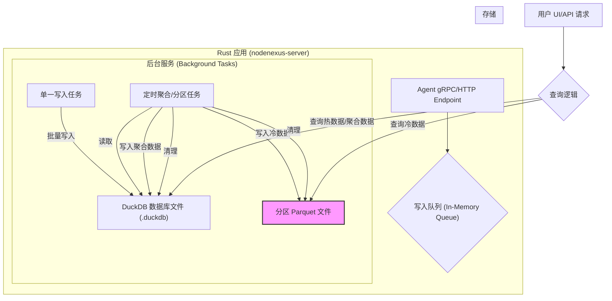

# 数据库迁移计划：从 TimescaleDB 到 DuckDB

**最后更新**: 2025-07-25

**作者**: Roo

## 1. 背景与目标

当前项目后端使用 TimescaleDB 作为主数据库。在实际部署中发现，TimescaleDB 实例内存占用较高（约 4GB），而目标用户服务器的典型配置仅为 1GB 内存。这个硬性技术约束使得继续使用 TimescaleDB 变得不可行。

**核心目标**: 将项目后端数据库从 TimescaleDB 替换为一个轻量级的嵌入式数据库，以满足低内存占用的部署要求，同时保证时序数据处理的核心功能和良好的查询性能。

经过分析，我们选择 **DuckDB** 作为目标数据库，因为它在提供极致分析性能的同时，也能通过应用层架构设计来满足项目的写入和数据管理需求。

## 2. 核心架构设计

我们将放弃 TimescaleDB 提供的自动化功能，转而在 Rust 应用程序内部实现一个“微型时序管理引擎”。

**架构关键点**:

1.  **写入队列**: 所有 Agent 指标数据先进入内存队列，解耦写入请求。
2.  **序列化写入**: 一个专用的后台任务从队列中批量取出数据，序列化写入 DuckDB，避免并发写入冲突。
3.  **冷热数据分离**:
    *   **热数据 (Hot Data)**: DuckDB 主文件 (`.duckdb`) 存储近期（如24小时内）的原始数据和所有聚合数据。
    *   **冷数据 (Cold Data)**: 过期的原始数据被归档为按日期分区的 Parquet 文件。
4.  **手动聚合**: 后台任务定时（如每小时）运行，预计算分钟、小时、天级别的聚合数据，存入主数据库的聚合表中。
5.  **手动保留策略**: 后台任务负责根据预设规则，删除过期的聚合数据和冷数据分区文件。

## 3. 实施阶段与任务分解

### 阶段一：环境搭建与基础重构

**目标**: 引入 DuckDB 依赖，建立新的数据库服务层，并重构非时序相关的数据库操作。

1.  **依赖管理**:
    *   在 `backend/crates/server/Cargo.toml` 中添加 `duckdb` crate。
    *   移除 `sea-orm` 和 `sqlx` 的 `postgres` 相关特性。
2.  **新数据库模块**:
    *   创建 `backend/crates/server/src/db/duckdb_service.rs`。
    *   此模块负责初始化 DuckDB 连接及管理后台任务。
3.  **重构常规表**:
    *   将 `users`, `vps`, `tags` 等非时序表的 `sea-orm` 实体和 CRUD 操作迁移至使用 DuckDB。
    *   **备选方案**: 若 `sea-orm` 兼容性不佳，则使用 `duckdb-rs` 编写原生 SQL。
4.  **迁移脚本**:
    *   创建 `backend/duckdb_migrations/` 目录。
    *   转换现有 `CREATE TABLE` 脚本为 DuckDB 兼容语法。

### 阶段二：实现“微型时序管理引擎”

**目标**: 构建处理时序数据的核心逻辑。

1.  **写入队列与服务**:
    *   使用 `tokio::sync::mpsc::channel` 创建写入队列。
    *   创建后台任务，作为唯一写入者，使用 `duckdb-rs` 的 `Appender` API 批量写入。
2.  **聚合与分区服务**:
    *   创建定时运行的后台“维护者”任务。
    *   **聚合**: 执行 SQL 计算聚合数据，并 `INSERT OR REPLACE` 到聚合表中。
    *   **分区/归档**: 使用 `COPY ... TO ... (FORMAT PARQUET, PARTITION_BY (...))` 将冷数据导出到 Parquet 文件。
    *   **清理**: 归档成功后，从主库 `DELETE` 已归档的数据。
3.  **数据保留服务**:
    *   “维护者”任务包含清理逻辑，删除过期的 Parquet 文件和聚合表中的记录。

### 阶段三：重构查询逻辑与 API

**目标**: 将所有读取数据的代码迁移到新的 DuckDB 服务。

1.  **重构仪表盘查询**:
    *   修改数据 API 端点，实现分层查询逻辑：优先查聚合表 -> 查主库热数据 -> 查 Parquet 冷数据。
2.  **验证所有数据接口**:
    *   系统性地检查并重构所有与数据库交互的 API 接口。

### 阶段四：测试与部署

**目标**: 确保新架构的稳定性和性能。

1.  **测试**:
    *   为新服务编写单元测试和集成测试。
    *   模拟高并发写入和复杂查询场景。
2.  **性能基准测试**:
    *   对比新旧架构的写入吞吐量和查询响应时间。
    *   验证在 1GB 内存环境下的实际性能和资源占用。
3.  **部署文档**:
    *   更新 `Dockerfile` 和部署文档，移除外部数据库依赖。

## 4. 风险与应对

*   **开发工作量大**: 这是主要风险。
    *   **应对**: 严格按阶段进行，分步实现，充分测试。
*   **重构工作量巨大**: 由于必须完全移除 `sqlx` 和 `sea-orm`，所有数据库交互逻辑都需要用 `duckdb-rs` 重写。这是本次迁移中最大、最核心的风险。
    *   **应对**: 投入充足的开发时间，并进行严格的代码审查和测试，确保新实现的逻辑正确无误。
*   **性能调优**: 手动实现的后台任务可能存在性能问题。
    *   **应对**: 进行充分的基准测试，优化 SQL 和任务调度逻辑。
