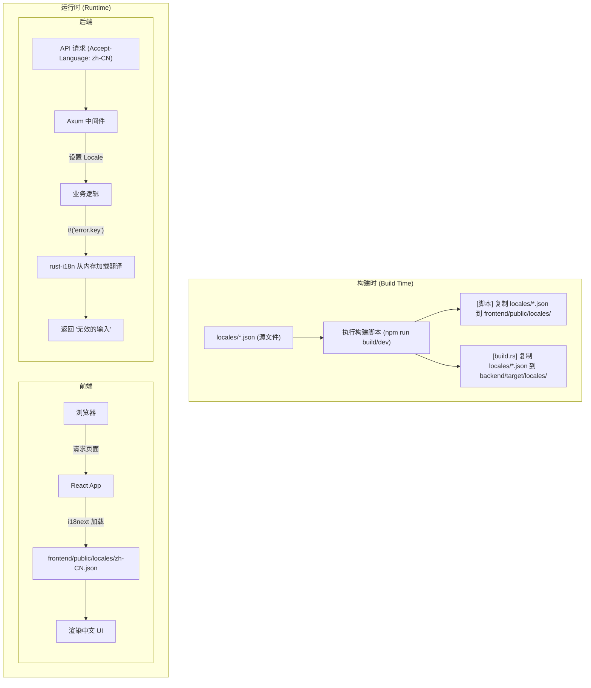

# 多语言 (i18n) 实施计划

本文档详细描述了为项目添加多语言支持的架构设计和实施步骤。该方案旨在实现一个可维护、可扩展且前后端体验一致的国际化系统。

## 1. 核心架构：单源 i18n 方案

我们采用**“单源 i18n 方案” (Single Source of Truth i18n)**。此方案的核心思想是：

- **单一来源**: 所有翻译文件（如 `en.json`, `zh-CN.json`）都集中存放在项目根目录的 `locales` 文件夹下。
- **构建时分发**: 在开发和构建阶段，通过脚本自动将这些共享的翻译文件分发到前端和后端各自需要的位置。
- **前后端协同**: 前后端都使用同一套翻译文件。后端能够独立生成本地化的消息（如 API 错误），前端负责渲染 UI。
- **统一插值**: 前后端统一使用 `%{variable}` 的插值语法，通过配置前端的 `i18next` 库来实现兼容。

### 1.1. 架构图



## 2. 实施步骤

### 阶段一：基础建设

1.  **创建中央 `locales` 目录**:
    -   在项目根目录下创建 `locales` 文件夹。
    -   在 `locales/` 中创建 `en.json` 和 `zh-CN.json` 文件。
    -   **统一插值格式**: 所有带动态参数的翻译，都使用 `%{variable}` 格式。
        ```json
        // en.json
        {
          "buttons": {
            "save": "Save"
          },
          "errors": {
            "notFound": "Page '%{page}' not found."
          }
        }
        ```

2.  **创建文件同步脚本**:
    -   在项目根目录创建 `scripts/sync-locales.js` 文件，用于将根目录的 `locales` 复制到前端。

3.  **配置前端构建脚本**:
    -   修改 `frontend/package.json`，添加 `predev` 和 `prebuild` 钩子来自动执行同步脚本。

4.  **配置后端构建脚本**:
    -   创建 `backend/build.rs` 文件，在编译 Rust 项目前，将根目录的 `locales` 文件夹复制到后端的编译目标目录。

### 阶段二：后端改造 (Rust)

1.  **数据库迁移**:
    -   在 `users` 表中添加 `language` 字段 (类型: `VARCHAR`, 默认值: `'auto'`)，用于存储用户的语言偏好。

2.  **更新实体模型**:
    -   在 `backend/src/db/entities/user.rs` 的 `Model` 结构体中添加 `pub language: String` 字段。

3.  **添加 API 端点**:
    -   在 `backend/src/web/routes/user_routes.rs` 中，添加一个新的 `PUT /api/users/preference` 路由。
    -   该路由负责接收 `{ "language": "en" | "zh-CN" | "auto" }` 并更新数据库。

4.  **集成 `rust-i18n`**:
    -   在 `backend/Cargo.toml` 中添加 `rust-i18n` 依赖。
    -   在 `main.rs` 中使用 `i18n!("locales", fallback = "en");` 加载翻译。
    -   创建 Axum 中间件，根据用户偏好或 `Accept-Language` 头来设置当前请求的 `locale`。

### 阶段三：前端改造 (React)

1.  **安装依赖**:
    -   在 `frontend/` 目录下运行 `npm install i18next react-i18next i18next-http-backend i18next-browser-languagedetector`。

2.  **创建 i18n 配置文件**:
    -   创建 `frontend/src/i18n.ts`。
    -   在 `init` 方法中，**必须**配置 `interpolation` 选项以兼容后端的语法：
        ```typescript
        interpolation: {
          escapeValue: false,
          prefix: '%{',
          suffix: '}'
        }
        ```

3.  **全局加载**:
    -   在 `frontend/src/main.tsx` 中 `import './i18n';`。

4.  **添加语言设置 UI**:
    -   在 `frontend/src/pages/AccountSettingsPage.tsx` 中，新增一个“偏好设置”卡片。
    -   使用下拉菜单（Select 组件）提供语言选项：“跟随浏览器 (auto)”, “English”, “简体中文”。
    -   选项变更时，调用 API 更新后端用户偏好，并使用 `i18n.changeLanguage()` 立即刷新界面。

5.  **全局文本替换**:
    -   在所有需要翻译的组件中，使用 `useTranslation` hook。
    -   将硬编码的文本（如 "Save"）替换为 `t('buttons.save')` 的形式。

## 3. 任务清单

-   [ ] 创建 `locales` 目录及初始翻译文件。
-   [ ] 创建 `scripts/sync-locales.js` 脚本。
-   [ ] 创建 `backend/build.rs` 脚本。
-   [ ] 修改 `frontend/package.json`。
-   [ ] 执行数据库迁移。
-   [ ] 更新后端的 `user` 实体。
-   [ ] 实现后端的 `preference` API。
-   [ ] 实现后端的 i18n 中间件。
-   [ ] 安装前端 i18n 相关依赖。
-   [ ] 创建并配置前端 `i18n.ts` 文件。
-   [ ] 在 `AccountSettingsPage` 中添加 UI。
-   [ ] 逐步替换项目中的硬编码字符串。