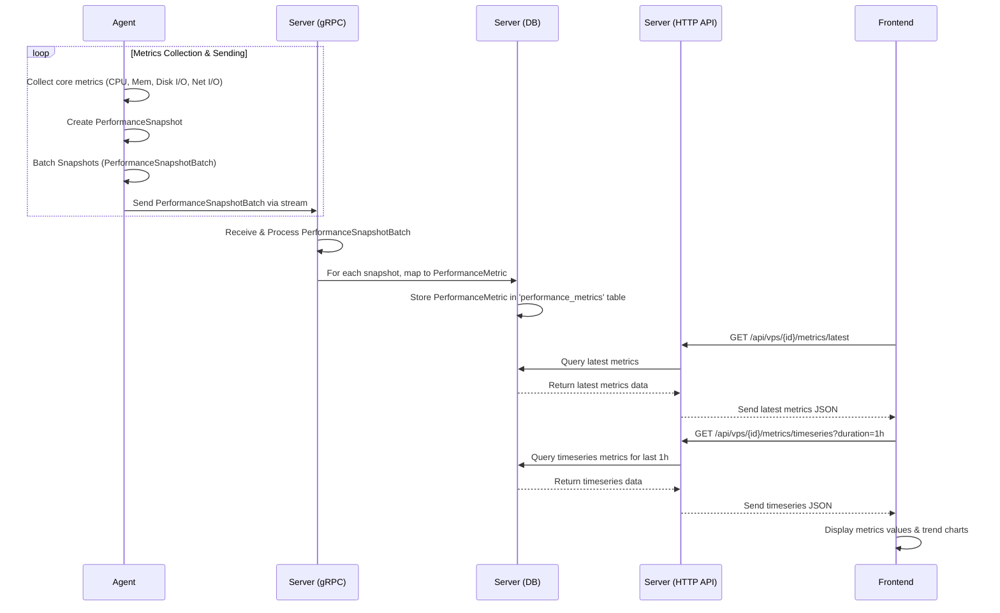

# 基础指标监控功能实现计划

## 核心需求总结

*   **Agent：** 收集核心指标（CPU、总内存、总磁盘I/O、总网络I/O），使用 Rust 生态库。
*   **Server：** 接收、处理并存储这些核心指标。提供 API 给前端。
*   **Frontend：** 展示这些核心指标的实时值和过去1小时的趋势图。

## 阶段一：后端实现 (Agent & Server)

1.  **Protobuf 定义确认 (`backend/proto/messages.proto`)**
    *   目标：确认 Agent 可以向 Server 发送性能指标数据。
    *   状态：**已确认。** `MessageToServer` 中的 `payload` oneof 已包含 `PerformanceSnapshotBatch performance_batch = 3;`。Agent 可以直接使用此载荷类型。

2.  **Agent 端实现 (`backend/src/bin/agent.rs` 及可能的新模块)**
    *   **指标收集模块：**
        *   实现逻辑以收集以下核心指标，并填充到 `PerformanceSnapshot` 结构中：
            *   `cpu_overall_usage_percent`: 整体 CPU 使用百分比。
            *   `memory_usage_bytes`: 已用内存。
            *   `memory_total_bytes`: 总内存。
            *   `disk_total_io_read_bytes_per_sec`: 总磁盘读取字节/秒。
            *   `disk_total_io_write_bytes_per_sec`: 总磁盘写入字节/秒。
            *   汇总所有网络接口的 `rx_bytes_per_sec` 和 `tx_bytes_per_sec` (来自 `NetworkInterfaceStats`)。
        *   使用 Rust 生态中的库 (例如 `sysinfo` crate) 来获取这些系统指标。
    *   **指标发送逻辑：**
        *   遵循 `AgentConfig` 中的 `metrics_collect_interval_seconds`, `metrics_upload_batch_max_size`, `metrics_upload_interval_seconds` 配置。
        *   将收集的 `PerformanceSnapshot` 实例聚合成 `PerformanceSnapshotBatch`。
        *   通过现有的 gRPC 双向流 `EstablishCommunicationStream`，使用 `performance_batch` 载荷将数据发送到 Server。

3.  **数据库迁移 (`backend/migrations/`)**
    *   目标：创建 `performance_metrics` hypertable。
    *   操作：创建一个新的迁移文件 (例如 `YYYYMMDDHHMMSS_create_performance_metrics_table.sql`)，内容如下：
        ```sql
        -- Create performance_metrics table
        CREATE TABLE performance_metrics (
            time TIMESTAMPTZ NOT NULL,
            vps_id INTEGER NOT NULL REFERENCES vps(id) ON DELETE CASCADE,
            cpu_usage_percent DOUBLE PRECISION NOT NULL,
            memory_usage_bytes BIGINT NOT NULL,
            memory_total_bytes BIGINT NOT NULL,
            disk_io_read_bps BIGINT NOT NULL,
            disk_io_write_bps BIGINT NOT NULL,
            network_rx_bps BIGINT NOT NULL,
            network_tx_bps BIGINT NOT NULL
        );

        -- Convert to hypertable, partitioned by time
        -- SELECT create_hypertable('performance_metrics', 'time');
        -- Note: Ensure TimescaleDB extension is enabled in your PostgreSQL instance.
        -- If not using TimescaleDB directly or want to defer hypertable creation:
        -- CREATE INDEX ON performance_metrics (vps_id, time DESC);

        -- It's good practice to also add an index on vps_id and time for efficient querying.
        -- If not using hypertable which typically creates this:
        -- CREATE INDEX idx_performance_metrics_vps_id_time ON performance_metrics (vps_id, time DESC);
        ```
        *   **注意：** `create_hypertable` 命令需要 TimescaleDB 扩展。如果项目中未使用或尚未配置 TimescaleDB，可以先创建普通表和索引，后续再转换为 hypertable。

4.  **数据库模型调整 (`backend/src/db/models.rs`)**
    *   目标：使 `PerformanceMetric` 结构体与新的表定义一致。
    *   操作：修改 `PerformanceMetric` 结构体：
        ```rust
        // #[derive(Debug, Clone, Serialize, Deserialize, FromRow)]
        // pub struct PerformanceMetric {
        //     pub time: DateTime<Utc>,
        //     pub vps_id: i32,
        //     pub cpu_usage_percent: f64, // Renamed from cpu_usage
        //     pub memory_usage_bytes: i64, // Changed type from f64, renamed from mem_usage
        //     pub memory_total_bytes: i64, // New field
        //     pub disk_io_read_bps: i64,   // Renamed from disk_io_read
        //     pub disk_io_write_bps: i64,  // Renamed from disk_io_write
        //     pub network_rx_bps: i64,     // Renamed from net_rx
        //     pub network_tx_bps: i64,     // Renamed from net_tx
        // }
        ```

5.  **Server 端实现 (`backend/src/server/handlers.rs`, `backend/src/db/services.rs` 或新模块)**
    *   **消息处理 (`backend/src/server/handlers.rs`)：**
        *   在 `handle_connection` 函数的消息处理循环中，增加对 `performance_batch` (`MessageToServer.Payload.performance_batch`) 载荷的处理逻辑。
    *   **数据入库 (`backend/src/db/services.rs` 或新模块)：**
        *   为每个接收到的 `PerformanceSnapshot`：
            *   提取核心指标值，并映射到调整后的 `PerformanceMetric` 结构体。
            *   调用数据库服务将 `PerformanceMetric` 数据保存到 `performance_metrics` 表。
    *   **HTTP API 开发 (`backend/src/http_server/mod.rs` 或新模块)：**
        *   创建新的 HTTP GET API 接口：
            *   `/api/vps/{vps_id}/metrics/latest`: 获取指定 VPS 的最新核心指标。
            *   `/api/vps/{vps_id}/metrics/timeseries?start_time=<timestamp>&end_time=<timestamp>&interval=<e.g., 1m, 5m, 1h>`: 获取指定 VPS 在指定时间范围和聚合间隔的核心指标时间序列数据。对于“过去1小时”，前端可以计算 `start_time` 和 `end_time`。

## 阶段二：前端实现 (`frontend/src/...`)

1.  **API 服务 (`frontend/src/services/`)**
    *   创建 `metricsService.ts`。
    *   实现调用后端 `/api/vps/{vps_id}/metrics/latest` 和 `/api/vps/{vps_id}/metrics/timeseries` 接口的函数。
2.  **状态管理 (`frontend/src/store/`)**
    *   在现有的 Zustand store (例如 `authStore.ts` 或创建一个新的 `metricsStore.ts`) 中：
        *   添加用于存储最新指标和时间序列数据的状态。
        *   添加 actions 来调用 `metricsService.ts` 中的函数并更新状态。
3.  **UI 组件和页面 (`frontend/src/components/`, `frontend/src/pages/`)**
    *   **指标展示组件：**
        *   创建用于显示单个实时指标值（如 CPU: 75%）的组件。
        *   创建用于显示单个指标趋势图（例如，使用 `recharts` 或 `chart.js` 库）的组件。
    *   **页面集成：**
        *   在 VPS 详情页面 (如果存在，或者可以考虑在 `HomePage.tsx` 列出 VPS 后，点击进入的新页面) 集成这些组件。
        *   页面加载时，获取并展示选定 VPS 的最新核心指标和过去1小时的趋势图。
        *   考虑加入定时刷新机制来更新实时数据。

## 数据流和组件交互图示

**数据流 (Sequence Diagram):**


**组件交互 (Simplified Architecture):**
```mermaid
graph TD
    subgraph Agent Host
        A[OS Metrics]
    end
    subgraph Agent Process
        B1[Metric Collector (sysinfo)]
        B2[gRPC Client]
    end
    subgraph Server
        C1[gRPC Service Handler]
        C2[Metric Processing Logic]
        C3[Database Service]
        D[(TimescaleDB: performance_metrics)]
        C4[HTTP API Endpoints]
    end
    subgraph Frontend Application
        E1[Metrics API Service (axios/fetch)]
        E2[State Management (Zustand)]
        E3[UI Components (React)]
        F[Charts (Recharts/Chart.js)]
        G[Metrics Dashboard/Page]
    end

    A -- Provides data to --> B1;
    B1 -- Creates PerformanceSnapshot --> B2;
    B2 -- Sends PerformanceSnapshotBatch --> C1;
    C1 -- Passes data to --> C2;
    C2 -- Transforms data for --> C3;
    C3 -- Writes to --> D;

    G -- User interaction triggers --> E1;
    E1 -- Fetches data from --> C4;
    C4 -- Queries data via C3 from --> D;
    D -- Returns data to --> C4;
    C4 -- Returns JSON to --> E1;
    E1 -- Updates --> E2;
    E2 -- Provides data to --> E3;
    E3 -- Renders data and uses --> F;
    F -- Displays charts in --> G;