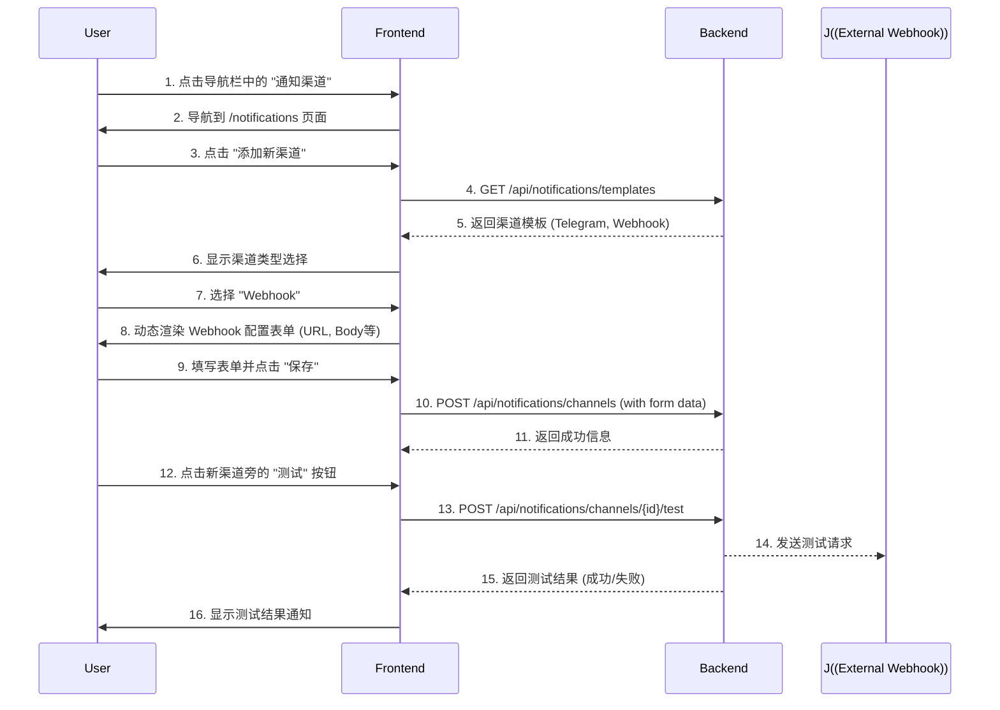

# 推送渠道管理功能设计方案

## 1. 核心目标

*   **可扩展性**: 方便未来添加新的推送渠道类型（如 Email, Slack 等）。
*   **灵活性**: 用户可以通过“自定义 Webhook”接入任何支持的系统，并能自定义消息格式。
*   **安全性**: 对用户配置中的敏感信息（如 API Token）进行加密存储。
*   **易用性**: 前端 UI 能根据渠道类型动态生成配置表单，并提供测试功能以快速验证配置。

## 2. 数据库设计

我们将在现有数据库中添加两张新表：

1.  `notification_channels`: 存储用户配置的推送渠道。
2.  `alert_rule_channels`: 关联警报规则和推送渠道（多对多关系）。

```mermaid
erDiagram
    users {
        int id PK
        varchar username
        -- etc --
    }

    alert_rules {
        int id PK
        int user_id FK
        varchar metric_type
        -- etc --
    }

    notification_channels {
        int id PK
        int user_id FK "one user has many channels"
        varchar name "e.g., 'My Telegram Bot'"
        varchar channel_type "e.g., 'telegram', 'webhook'"
        blob config "Encrypted JSON with channel settings"
        datetime created_at
        datetime updated_at
    }

    alert_rule_channels {
        int alert_rule_id FK "one alert has many channels"
        int channel_id FK "one channel is used by many alerts"
    }

    users ||--o{ notification_channels : "has"
    alert_rules ||--|{ alert_rule_channels : "links to"
    notification_channels ||--|{ alert_rule_channels : "links to"
}
```

*   `notification_channels.config`: 此字段将以加密的 JSON 格式存储配置信息，例如 Telegram 的 `bot_token` 和 `chat_id`，或 Webhook 的 `url` 和 `body_template`。

## 3. 后端设计

我们将创建一个新的 `notifications` 模块来处理所有相关逻辑。

### 架构图

```mermaid
graph TD
    subgraph "HTTP Server"
        A["/api/notifications/*"] --> B{Notification Routes};
    end

    subgraph "Notification Module"
        B --> C[Notification Service];
        C --> D[Channel Senders];
        C --> E[Encryption Service];
        C --> F[Templating Engine (Tera)];
    end

    subgraph "Data"
        C --> G[DB: notification_channels];
    end
    
    subgraph "Alerting System"
        H[Alert Triggered] --> I[Alert Service];
        I --> C;
    end

    D -- "sends to" --> J((External Services));

    style C fill:#9cf,stroke:#333,stroke-width:2px
```

### 主要组件

1.  **API Endpoints (`/api/notifications`)**:
    *   `GET /channels/templates`: 获取所有可用渠道的定义（字段、类型等），供前端动态生成表单。
    *   `GET /channels`: 获取当前用户的所有已配置渠道。
    *   `POST /channels`: 创建一个新的渠道（配置信息将被加密）。
    *   `PUT /channels/:id`: 更新一个已有的渠道。
    *   `DELETE /channels/:id`: 删除一个渠道。
    *   `POST /channels/:id/test`: 发送一条测试消息到指定渠道。

2.  **Encryption Service**:
    *   负责在数据存入数据库前加密 `config` 字段，在读取后解密。将使用应用配置中的一个密钥进行对称加密。

3.  **Templating Engine**:
    *   使用 `Tera` 库来解析用户自定义的消息模板。当警报触发时，它会用真实数据（如 `{{vps_name}}`, `{{metric_type}}`, `{{value}}`）替换模板中的占位符。

4.  **Channel Senders**:
    *   为每种渠道类型（Telegram, Webhook）实现一个具体的发送逻辑。
    *   `TelegramSender`: 使用 Telegram Bot API 发送消息。
    *   `WebhookSender`: 使用 `reqwest` 库向用户指定的 URL 发送 HTTP 请求。

5.  **Alert Service (修改)**:
    *   当一个警报被触发时，它会查询 `alert_rule_channels` 表，找到所有关联的渠道，并调用 `Notification Service` 来分发通知。

## 4. 前端设计 (已更新)

我们将在前端应用中创建一个全新的独立页面来管理推送渠道，以保持功能模块的清晰性。

### 交互流程



### 关键组件

1.  **`NotificationsPage.tsx`**: 新建一个页面级组件，路径为 `/notifications`。它将负责展示渠道列表、管理模态框等所有与推送渠道相关的 UI。
2.  **`notificationService.ts`**: 新建一个 service 文件，封装所有与推送渠道相关的 API 请求。
3.  **`DynamicForm.tsx`**: 一个可复用的表单组件，它接收从后端获取的模板定义，并自动渲染出对应的输入框、选择框等。
4.  **`App.tsx` / `Layout.tsx` (修改)**:
    *   在主路由器中为 `/notifications` 添加新路由，指向 `NotificationsPage`。
    *   在主导航栏中添加入口，链接到 `/notifications` 页面。
5.  **`AlertRuleModal.tsx` (修改)**: 将原有的通知方式输入框，改为一个多选下拉框，允许用户从已配置的推送渠道列表中选择一个或多个。