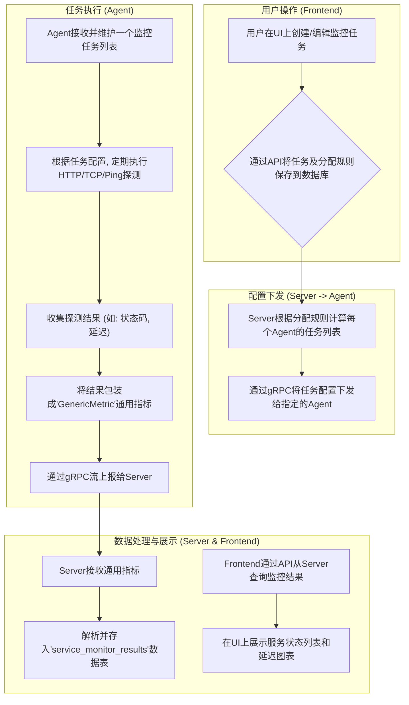
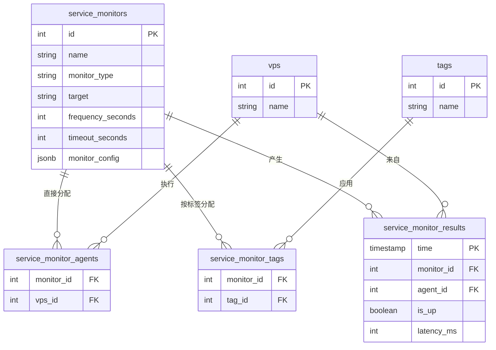
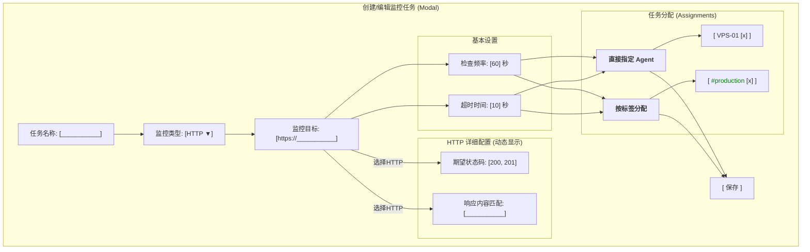

# 服务监控功能 - 功能设计与技术方案 (V4 - 最终确认版)

**目标:** 实现一个灵活、稳定、可扩展的服务监控功能，允许用户通过指定的Agent对HTTP、TCP、Ping等服务进行定期探测，并记录和展示结果。

---

## 1. 核心流程



---

## 2. 数据库模型

### 2.1. 实体关系图 (ERD)



### 2.2. 表结构定义

*   **`service_monitors`**: 存储监控任务的配置。
    *   `id` (PK, serial)
    *   `user_id` (FK, integer, not null)
    *   `name` (varchar, not null)
    *   `monitor_type` (varchar, not null) - 'http', 'ping', 'tcp'
    *   `target` (varchar, not null)
    *   `frequency_seconds` (integer, not null, default: 60)
    *   `timeout_seconds` (integer, not null, default: 10)
    *   `is_active` (boolean, not null, default: true)
    *   `monitor_config` (jsonb, nullable) - 存储特定类型的配置
    *   `created_at`, `updated_at` (timestamptz)

*   **`service_monitor_agents`** (关联表):
    *   `monitor_id` (FK to `service_monitors.id`, PK)
    *   `vps_id` (FK to `vps.id`, PK)

*   **`service_monitor_tags`** (关联表):
    *   `monitor_id` (FK to `service_monitors.id`, PK)
    *   `tag_id` (FK to `tags.id`, PK)

*   **`service_monitor_results`** (TimescaleDB Hypertable):
    *   `time` (TIMESTAMPTZ, not null)
    *   `monitor_id` (FK to `service_monitors.id`, not null)
    *   `agent_id` (FK to `vps.id`, not null)
    *   `is_up` (boolean, not null)
    *   `latency_ms` (integer, not null)
    *   `details` (jsonb, nullable) - e.g., `{"status_code": 200, "error": ""}`

### 2.3. `monitor_config` 示例

```json
{
  "http": {
    "method": "GET",
    "expected_status_codes": [200],
    "request_headers": {},
    "request_body": null,
    "response_body_match": "",
    "ignore_tls_errors": false
  },
  "ping": {
    "packet_count": 4
  },
  "tcp": {}
}
```

---

## 3. Protobuf 扩展 (`proto/service.proto`)

```protobuf
// In message AgentConfig
message AgentConfig {
  // ... existing fields
  repeated ServiceMonitorTask service_monitor_tasks = 10;
}

// New message definition
message ServiceMonitorTask {
  int32 monitor_id = 1;
  string name = 2;
  string monitor_type = 3;
  string target = 4;
  int32 frequency_seconds = 5;
  string monitor_config_json = 6; // Specific config as a JSON string
  int32 timeout_seconds = 7;
}
```

---

## 4. Agent 端执行策略 (最佳实践)

-   **启动延迟 (Jitter):** 新任务启动时加入一个0到`frequency_seconds`的随机延迟，避免惊群效应。
-   **并发控制:** Agent内部使用`tokio::sync::Semaphore`限制同时执行的监控任务数量（可配置，默认如20），保护自身资源。
-   **首次立即执行:** 新任务或配置变更后立即执行一次，为用户提供即时反馈。

---

## 5. 前端 UI 与 UX

### 5.1. 任务创建/编辑弹窗UI草图



### 5.2. 核心UX逻辑

-   **动态表单:** 根据选择的`monitor_type`动态显示或隐藏特定于类型的配置区域。
-   **分配选择器:** 提供两个独立的多选框，分别用于“直接指定Agent”和“按标签分配”。
-   **状态显示:** 在UI上明确区分 **"Down"** (服务不可达) 和 **"No Data / Agent Offline"** (监控中断) 两种状态。

---

## 6. 后端API接口

-   **监控任务管理:**
    -   `POST /api/monitors` (创建)
    -   `GET /api/monitors` (列表)
    -   `GET /api/monitors/{id}` (详情)
    -   `PUT /api/monitors/{id}` (更新)
    -   `DELETE /api/monitors/{id}` (删除)
-   **监控结果查询:**
    -   `GET /api/monitors/{id}/results` (获取历史数据)