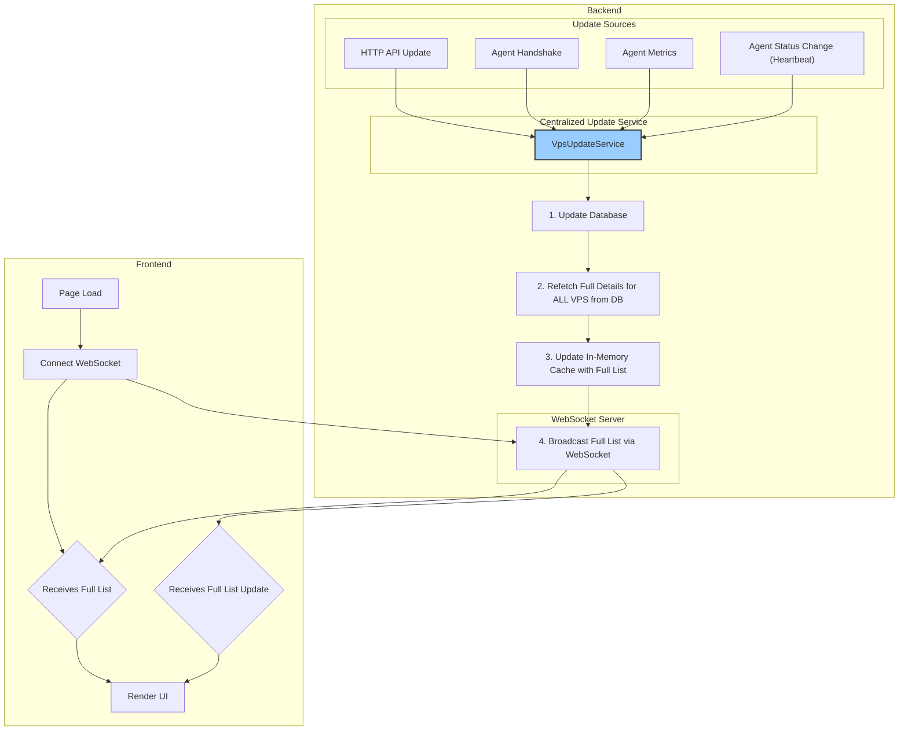

# 系统数据流重构计划

## 1. 目标

重构系统的数据同步机制，以实现以下目标：

- **单一数据源**: Web UI 的所有 VPS 数据（包括列表、状态、指标）完全通过 WebSocket 推送获取，不再通过 HTTP API 获取。
- **数据一致性**: 无论通过何种方式（API 调用、Agent 上报）修改了 VPS 数据，服务器端的内存缓存都能被及时、统一地更新。
- **实时性**: 任何数据的变更都能被实时地广播给所有连接的前端客户端。

## 2. 核心原则

- **统一更新入口**: 创建一个集中的更新服务，所有对 VPS 数据的修改都必须通过此服务处理。
- **全量数据广播**: 每当任何一个 VPS 的数据发生变化，都向所有客户端广播完整的、最新的 VPS 列表。此方案优先保证实现的简单性和可靠性。

## 3. 当前系统问题分析

1.  **数据更新路径不一致**:
    - **HTTP API 更新**: 流程正确（DB -> 缓存 -> 广播），但仅限于此路径。
    - **Agent Handshake**: 更新数据库后，流程中断，未更新缓存和广播。
    - **Agent Metrics**: 更新数据库和缓存后，流程中断，未进行广播。
2.  **前端数据来源冗余**: 页面加载时，同时通过 HTTP API 和 WebSocket 获取数据，存在冗余和竞态风险。
3.  **Agent 离线状态处理缺失**: 没有机制来检测 Agent 断连并更新其状态到 "offline"，导致前端显示过时的在线状态。

## 4. 新设计方案

### 4.1. 架构图

### 4.2. 后端改造步骤

1.  **创建中央更新服务 (`src/server/update_service.rs`)**:
    - 将 `http_server/vps_routes.rs` 中的 `update_cache_and_broadcast` 函数逻辑提取并扩展，创建一个新的公共函数，例如 `broadcast_full_state_update`。
    - 此函数将成为系统中唯一的广播触发点。它的职责是：锁定缓存、从数据库查询所有用户的完整 VPS 列表 (`get_all_vps_with_details_for_cache`)、用最新数据完全替换缓存内容、最后将整个缓存列表广播出去。

2.  **统一各更新路径**:
    - **HTTP API (`vps_routes.rs`)**: 在 `update_vps_handler` 和 `bulk_update_vps_tags_handler` 的数据库操作成功后，调用 `broadcast_full_state_update`。
    - **Agent Handshake (`server/handlers.rs`)**: 在 `update_vps_info_on_handshake` 成功后，调用 `broadcast_full_state_update`。
    - **Agent Metrics (`server/handlers.rs`)**: 在性能数据存入数据库后，调用 `broadcast_full_state_update`。

3.  **实现 Agent 离线状态处理**:
    - 在 `server/mod.rs` 或 `bin/server.rs` 的主函数中，`tokio::spawn` 一个新的后台心跳检查任务。
    - **心跳检查任务逻辑**:
        - 每隔 60 秒运行一次。
        - 遍历 `ConnectedAgents` 列表，检查每个 agent 的 `last_heartbeat` 时间戳。
        - 找出所有心跳时间超过 90 秒的 "失联" agent。
        - 对于每个失联 agent：
            - 调用 `services::update_vps_status` 将其数据库状态更新为 "offline"。
            - 从 `ConnectedAgents` 列表中移除。
        - 在所有失联 agent 处理完毕后，调用一次 `broadcast_full_state_update` 来广播所有状态变更。
    - **主动断连处理 (`server/handlers.rs`)**:
        - 在 gRPC 连接 `while` 循环结束后的清理逻辑中，获取当前 agent 的 `vps_db_id`。
        - 调用 `services::update_vps_status` 将其状态更新为 "offline"。
        - 调用 `broadcast_full_state_update` 立即广播此次状态变更。

### 4.3. 前端改造步骤

1.  **移除 HTTP 数据获取 (`frontend/src/services/vpsService.ts`)**:
    - 完全删除 `getVpsList` 函数。
    - 相关的组件（如 `HomePage.tsx`）中，移除对 `getVpsList` 的调用逻辑。

2.  **依赖 WebSocket 进行状态管理**:
    - 确保 `App.tsx` 或顶层布局组件在用户登录后，就初始化 `WebSocketService`。
    - `serverListStore` (Zustand store) 的状态完全由 `WebSocketService` 的 `onMessage` 回调驱动。
    - `onMessage` 回调的逻辑简化为：接收到 `FullServerListPush` 消息后，直接用 `message.servers` 数组替换整个 store 中的 `servers` 状态。