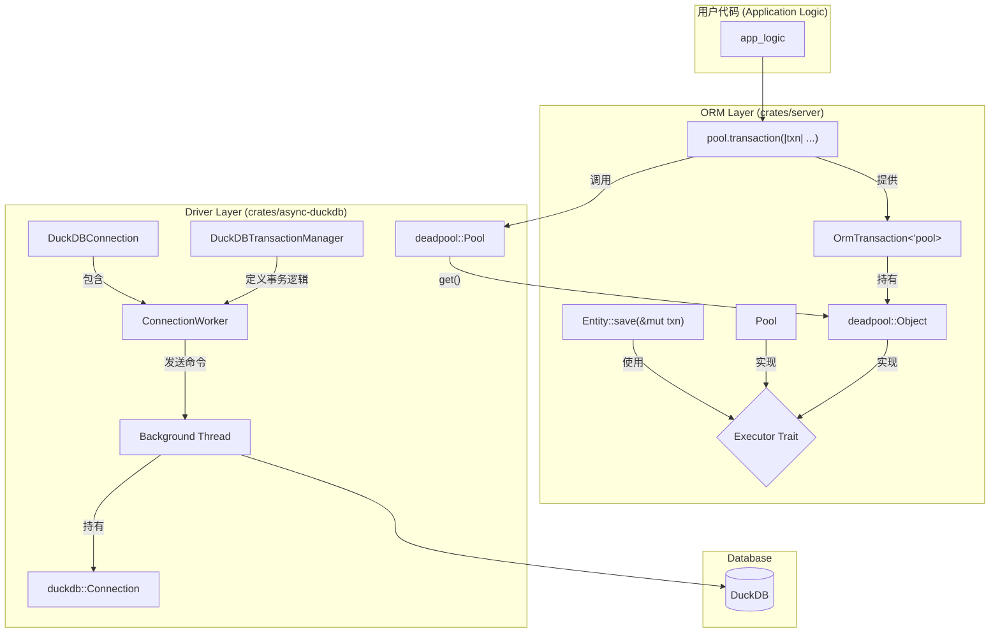

# ORM 事务与连接池实现计划

## 1. 引言与目标

本文档旨在为自定义 ORM 添加健壮的、生产级的事务处理能力。当前 `async-duckdb` crate 的实现不支持连接独占，无法实现事务。

通过深入研究 `sqlx` 和 `sea-orm` 的设计，我们制定了一个全面的重构和功能实现计划。**最终目标**是提供一个安全、高效且符合人体工程学的事务 API，同时从根本上提升 `async-duckdb` 驱动的架构质量。

## 2. 核心设计原则 (借鉴自 `sqlx`)

- **关注点分离**: 将连接管理、异步调度、数据库状态和事务逻辑清晰地分离开来。
- **后台工作线程**: 使用专用的后台线程来处理同步的数据库 FFI 调用，从而为上层提供完全异步的接口。
- **类型安全的配置**: 使用专门的 `Options` 结构体来配置连接，而不是通过零散的参数。
- **流式处理**: 查询结果应以异步流（Stream）的形式返回，以最小化内存占用。
- **RAII 模式**: 利用 Rust 的所有权和生命周期规则，通过 RAII 守卫（如 `Transaction` 对象）来自动管理资源（如事务的回滚）。
- **可观察性**: 提供详细的、上下文感知的日志记录，并为未来的性能分析（如慢查询日志）打下基础。
- **可扩展性**: 提供“逃生舱口”（如 FFI 访问），允许用户执行驱动未直接封装的高级功能。

## 3. 架构设计

我们将对 `async-duckdb` 进行重构，使其架构向 `sqlx` 看齐，并使用 `deadpool` 作为连接池。



### 组件说明:

- **`DuckDBConnection`**: 新的面向用户的异步连接对象。它不直接持有数据库句柄，而是持有一个到后台线程的通信句柄 (`ConnectionWorker`)。
- **`ConnectionWorker`**: 负责与后台线程进行异步通信。它将使用 `flume` MPSC 通道发送命令，并使用 `oneshot` 通道接收结果。
- **`Background Thread`**: 一个专用的 Rust 线程，它拥有 `duckdb::Connection` 的所有权，并在一个循环中同步地执行数据库操作。
- **`deadpool::Pool`**: 一个生产级的异步连接池，负责管理 `DuckDBConnection` 的生命周期。
- **`OrmTransaction`**: 一个 RAII 守卫。当它被创建时，会从池中获取一个连接并开始一个事务。当它被 `drop` 时，会自动回滚事务（除非 `commit` 已被调用）。
- **`Executor` Trait**: 一个定义了 `execute`, `fetch_one`, `fetch_all`, `fetch_stream` 等方法的 trait。`deadpool::Object<DuckDBConnection>` 和 `OrmTransaction` 都将实现此 trait，使得 ORM 的方法可以无缝地在单个连接或事务上执行。

## 4. 实施阶段

我们将分三个主要阶段来完成这个任务。

### 阶段一: 重构 `async-duckdb`

**目标**: 将 `async-duckdb` 从当前的 `Client`/`Pool` 模型重构为 `sqlx` 风格的 `Connection`/`Worker` 模型。

**详细任务**:

1.  **创建 `options.rs`**:
    *   定义 `DuckDBConnectOptions` 结构体，包含 `filename`, `flags`, `busy_timeout`, `statement_cache_capacity`, `log_settings` 等。
2.  **创建 `worker.rs`**:
    *   定义 `Command` enum，包含 `Execute`, `Fetch`, `Begin`, `Commit`, `Rollback`, `Ping`, `Shutdown` 等命令。
    *   实现 `ConnectionWorker` 结构体，包含 `command_tx: flume::Sender<Command>`。
    *   实现后台线程的 `run` 循环，该循环拥有 `duckdb::Connection`。
3.  **创建 `connection.rs`**:
    *   定义 `DuckDBConnection` 结构体，持有 `ConnectionWorker`。
    *   实现 `Connect` trait，并提供 `connect()` 方法，该方法会生成后台线程和 `ConnectionWorker`。
    *   实现 `Executor` trait 的相关方法 (`execute`, `fetch` 等)，这些方法会构建 `Command` 并通过 worker 发送。
4.  **实现流式查询**:
    *   `fetch` 方法将返回一个 `impl Stream<Item = Result<Row, Error>>`。后台 worker 会逐行发送结果，而不是一次性全部发送。
5.  **废弃旧代码**:
    *   移除 `client.rs` 和旧的 `pool.rs`。
    *   更新 `lib.rs` 以导出新的公共 API。

### 阶段二: 集成 `deadpool` 连接池

**目标**: 为新的 `DuckDBConnection` 实现一个真正的、生产级的连接池。

**详细任务**:

1.  **添加依赖**: 在 `async-duckdb` 的 `Cargo.toml` 中添加 `deadpool`。
2.  **创建 `pool.rs`**:
    *   定义 `Pool` 类型别名：`pub type Pool = deadpool::Pool<DuckDBConnection>`。
    *   定义 `PoolOptions`。
3.  **实现 `deadpool::managed::Manager`**:
    *   为 `DuckDBConnection` 实现 `Manager` trait。
    *   `create()`: 调用 `DuckDBConnection::connect()` 创建新连接。
    *   `recycle()`: 发送一个 `Ping` 命令到 worker 线程来检查其健康状况。如果 worker 已崩溃，则返回错误。

### 阶段三: 在 ORM 层实现事务 API

**目标**: 基于重构后的 `async-duckdb`，为 ORM 提供一个易于使用的事务 API。

**详细任务**:

1.  **更新 `server` 依赖**:
    *   在 `server` 的 `Cargo.toml` 中，将 `duckdb_service` 指向新的 `async-duckdb` 实现。
    *   用新的 `Pool` 替换旧的 `DuckDbPool`。
2.  **创建 `db/orm/executor.rs`**:
    *   定义 `Executor` trait。
    *   为 `deadpool::Object<DuckDBConnection>` 实现 `Executor`。
3.  **创建 `db/orm/transaction.rs`**:
    *   定义 `OrmTransaction<'a>` 结构体，它持有一个 `deadpool::Object<DuckDBConnection>`。
    *   实现 `Deref` 和 `DerefMut` 以便直接访问连接的方法。
    *   为 `OrmTransaction` 实现 `Executor` trait。
    *   实现 `commit(self)` 方法。
    *   实现 `Drop` trait，在 `drop` 时自动调用 `rollback()`。
4.  **提供 `pool.transaction()` 辅助函数**:
    *   在 `Pool` 的扩展 trait 中，实现 `async fn transaction<F, T, E>(&self, callback: F) -> Result<T, E>`。
    *   这个函数会自动处理 `pool.get()`, `begin()`, `commit()`, 和 `rollback()` 的逻辑。
5.  **更新 ORM 方法**:
    *   修改 `Entity` trait 和 `QueryBuilder` 中的所有数据库操作方法，使其接受一个泛型参数 `E: Executor`，而不是硬编码的 `&Pool`。

## 5. API 使用示例

重构完成后，用户可以像这样使用事务：

```rust
// 在服务或处理器中
async fn some_database_operation(pool: &Pool) -> Result<(), AppError> {
    let user_to_update = User { id: 1, name: "new_name".to_string() };
    let log_entry = Log { message: "User 1 updated".to_string() };

    // 使用闭包风格的事务
    pool.transaction(|txn| async move {
        // txn 现在是一个 Executor
        user_to_update.update(txn).await?;
        log_entry.insert(txn).await?;

        // 如果这里返回 Err，事务会自动回滚
        // 如果返回 Ok，事务会自动提交
        Ok(())
    }).await?;

    Ok(())
}
```

## 6. 未来展望

这个新的架构为未来的功能改进奠定了坚实的基础：

- **嵌套事务**: 通过在 worker 中跟踪事务深度，可以轻松支持 `SAVEPOINT`。
- **语句缓存**: 可以实现一个真正的语句缓存来提高性能。
- **更详细的日志**: 可以添加更多关于连接生命周期和慢查询的日志。