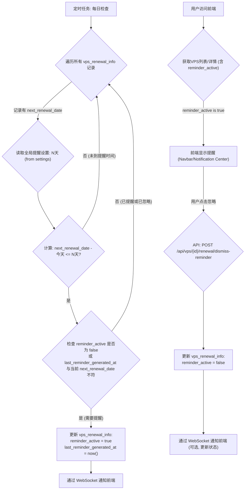
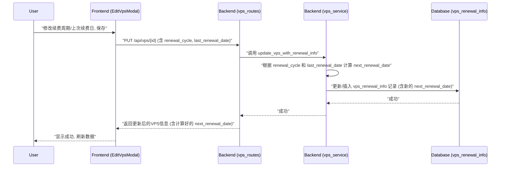

# VPS 续费管理功能实现计划

## 一、核心目标

为现有的 VPS 管理系统增加续费管理功能，包括记录续费信息、提供续费提醒、并在前端清晰展示相关数据。

## 二、后端调整 (`backend`)

### 1. 数据库模型 (`backend/src/db/models.rs`)

*   **`Vps` 结构体**: 保持核心 VPS 信息字段。
*   **新增 `VpsRenewalInfo` 结构体**:
    ```rust
    #[derive(Debug, Clone, Serialize, Deserialize, FromRow)]
    pub struct VpsRenewalInfo {
        pub vps_id: i32, // Primary Key, Foreign Key to vps.id
        pub renewal_cycle: Option<String>, // e.g., "monthly", "annually", "custom_days"
        pub renewal_cycle_custom_days: Option<i32>, // if renewal_cycle is "custom_days"
        pub renewal_price: Option<f64>,
        pub renewal_currency: Option<String>, // e.g., "USD", "CNY"
        pub next_renewal_date: Option<DateTime<Utc>>,
        pub last_renewal_date: Option<DateTime<Utc>>,
        pub service_start_date: Option<DateTime<Utc>>,
        pub payment_method: Option<String>,
        pub auto_renew_enabled: Option<bool>, // Default false
        pub renewal_notes: Option<String>,
        pub reminder_active: Option<bool>, // Default false, true if a reminder is active for next_renewal_date
        pub last_reminder_generated_at: Option<DateTime<Utc>>, // Tracks when the last reminder was generated for the current next_renewal_date
        pub created_at: DateTime<Utc>,
        pub updated_at: DateTime<Utc>,
    }
    ```

### 2. 数据库迁移

*   创建新的迁移文件：
    *   创建 `vps_renewal_info` 表。
    *   `vps_id` (INTEGER, NOT NULL, PRIMARY KEY, REFERENCES vps(id) ON DELETE CASCADE)。
    *   `renewal_cycle` (TEXT)。
    *   `renewal_cycle_custom_days` (INTEGER)。
    *   `renewal_price` (REAL)。
    *   `renewal_currency` (TEXT)。
    *   `next_renewal_date` (TIMESTAMPTZ)。
    *   `last_renewal_date` (TIMESTAMPTZ)。
    *   `service_start_date` (TIMESTAMPTZ)。
    *   `payment_method` (TEXT)。
    *   `auto_renew_enabled` (BOOLEAN, DEFAULT false)。
    *   `renewal_notes` (TEXT)。
    *   `reminder_active` (BOOLEAN, DEFAULT false)。
    *   `last_reminder_generated_at` (TIMESTAMPTZ)。
    *   `created_at` (TIMESTAMPTZ, NOT NULL, DEFAULT CURRENT_TIMESTAMP)。
    *   `updated_at` (TIMESTAMPTZ, NOT NULL, DEFAULT CURRENT_TIMESTAMP)。
    *   **不再创建 `renewal_reminders` 表。**

### 3. API 服务 (`backend/src/db/services/vps_service.rs`)

*   **创建/更新逻辑**:
    *   创建 `Vps` 时，若请求含续费信息，则在 `vps_renewal_info` 表插入记录。
    *   更新 `Vps` 时，若请求含续费信息，则更新 (或创建) `vps_renewal_info` 表记录。
    *   自动计算 `next_renewal_date` 的逻辑将操作 `vps_renewal_info` 表。
*   **查询逻辑**:
    *   获取 `Vps` 列表或详情时，`LEFT JOIN vps_renewal_info ON vps.id = vps_renewal_info.vps_id`。

### 4. HTTP 路由 (`backend/src/http_server/vps_routes.rs`)

*   `VpsListItemResponse` 和 `UpdateVpsRequest` 的结构定义对前端保持不变。后端负责数据的组装和拆分。
    *   `UpdateVpsRequest` 仍可包含 `renewalCycle`, `renewalPrice` 等字段。

### 5. WebSocket 模型 (`backend/src/websocket_models.rs`)

*   `ServerBasicInfo` 和 `ServerWithDetails` 结构体中续费相关的字段保持不变，数据填充时从 `vps_renewal_info` 表获取。

### 6. 续费提醒服务 (集成到 `VpsRenewalInfo`)

*   **提醒逻辑将集成到 `vps_service.rs` 或一个新的定时任务服务中。**
*   **服务逻辑**:
    *   每日定时任务检查 `vps_renewal_info` 表。
    *   对于每个 `VpsRenewalInfo` 记录：
        *   检查 `next_renewal_date` 是否在全局设置的提前提醒天数内。
        *   如果需要提醒，并且 `reminder_active` 为 `false` (或 `last_reminder_generated_at` 与当前 `next_renewal_date` 不匹配，表示是新的续费周期或之前未提醒)：
            *   设置 `reminder_active = true`。
            *   设置 `last_reminder_generated_at = CURRENT_TIMESTAMP`。
            *   通过 WebSocket 通知前端有活动的提醒。
    *   当 `next_renewal_date` 更新时 (例如用户手动续费或系统自动计算到下一个周期)，需要重置 `reminder_active = false` 和 `last_reminder_generated_at = NULL`。
*   **API 端点**:
    *   前端获取 VPS 列表/详情时，`VpsListItemResponse` 中会包含 `reminder_active` 字段。
    *   `POST /api/vps/{vps_id}/renewal/dismiss-reminder`: 用户在前端忽略提醒时调用此接口。
        *   后端将对应 `VpsRenewalInfo` 的 `reminder_active` 设置为 `false`。
        *   `last_reminder_generated_at` 可以保留，以避免在同一提醒周期内再次生成提醒，直到 `next_renewal_date` 改变。

## 三、前端调整 (`frontend`)

### 1. 类型定义 (`frontend/src/types/index.ts`)

*   `VpsListItemResponse` 接口保持不变，但会新增 `reminderActive?: boolean | null;` 和 `lastReminderGeneratedAt?: string | null;` 字段 (如果前端需要这些信息)。
*   **不再需要 `RenewalReminder` 接口。**

### 2. VPS 服务 (`frontend/src/services/vpsService.ts`)

*   `CreateVpsPayload` 和 `UpdateVpsPayload` 保持不变，包含续费相关字段。

### 3. VPS 详情页 (`frontend/src/pages/VpsDetailPage.tsx`)

*   新增 "续费信息" 卡片，展示所有续费字段。
*   清晰显示距离下次续费日期的天数，并根据紧急程度用不同颜色标记。

### 4. 编辑 VPS 弹窗 (`frontend/src/components/EditVpsModal.tsx`)

*   添加表单字段：
    *   续费周期 (下拉框: 月付, 季付, 半年付, 年付, 2年付, 3年付, 4年付, 自定义天数)。若选 "自定义天数"，则显示输入框。
    *   上次续费日期 (日期选择器)。
    *   服务开始日期 (日期选择器)。
    *   下次续费日期 (日期选择器 - 用户可手动修改)。
    *   续费价格 (数字输入框)。
    *   货币单位 (下拉框/输入框)。
    *   支付方式 (文本输入框)。
    *   自动续费 (开关)。
    *   续费备注 (文本区域)。

### 5. VPS 列表/卡片视图 (`frontend/src/components/VpsCard.tsx`, `frontend/src/components/VpsTableRow.tsx`)

*   **续费剩余时间进度条**:
    *   **计算逻辑** (前端组件内):
        1.  `cycleStartDate`: `lastRenewalDate` 或 `serviceStartDate`。
        2.  `nextRenewalDate`。
        3.  `totalCycleDays`: `(nextRenewalDate - cycleStartDate)` 的天数 (如果两者都有效)。如果 `renewalCycle` 是固定周期，也可以据此估算。
        4.  `daysPassedInCycle`: `(currentDate - cycleStartDate)` 的天数。
        5.  `daysRemaining`: `(nextRenewalDate - currentDate)` 的天数。
        6.  `progressPercentage`: `(daysPassedInCycle / totalCycleDays) * 100`。
    *   **UI 实现**:
        *   使用 `<div>` 和 CSS 构建进度条。
        *   进度条宽度根据 `progressPercentage` 设置。
        *   进度条颜色根据 `daysRemaining`:
            *   `> 30` 天: 绿色 (e.g., `bg-green-500`)
            *   `7-30` 天: 黄色 (e.g., `bg-yellow-500`)
            *   `< 7` 天: 红色 (e.g., `bg-red-500`)
        *   显示文本 "剩余 X 天"。
        *   若 `nextRenewalDate` 未设置，则不显示或提示 "未设置"。

### 6. 续费提醒展示 (`frontend/src/components/Navbar.tsx` 或专用通知组件)

*   Navbar 或通知中心根据 `VpsListItemResponse` 中的 `reminder_active` 状态来判断是否显示某个 VPS 的提醒。
*   可以汇总所有 `reminder_active: true` 的 VPS 数量作为角标。
*   点击提醒可跳转到 VPS 详情页。
*   提供忽略提醒的选项，调用新的 `POST /api/vps/{vps_id}/renewal/dismiss-reminder` API。

### 7. 设置页面 (`frontend/src/pages/SettingsPage.tsx`)

*   增加设置项: "续费提前提醒天数" (全局)。

## 四、Mermaid 流程图

### 续费提醒流程 (集成方案)


### 更新VPS时自动计算下次续费日


### 前端列表项渲染续费进度条
```mermaid
graph TD
    A["获取 VpsListItemResponse 数据"] --> B{"检查 nextRenewalDate 是否存在"};
    B -- "是" --> C{"计算 cycleStartDate, totalCycleDays, daysPassedInCycle, daysRemaining"};
    C --> D{"计算 progressPercentage = (daysPassedInCycle / totalCycleDays) * 100"};
    D --> E{"根据 daysRemaining 确定进度条颜色 (红/黄/绿)"};
    E --> F["渲染进度条 (宽度, 颜色) 和文本 \"剩余 X 天\""];
    B -- "否" --> G["显示 \"未设置续费\""];