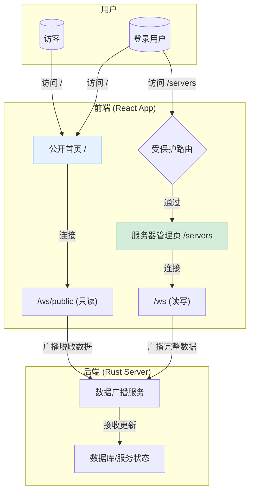

# WebUI 重构计划：基于双 WebSocket 通道的实时架构

**版本:** 1.0
**日期:** 2025-06-15
**作者:** Roo (AI Architect)

## 1. 目标

本次重构旨在将现有的 Web UI 拆分为一个公开的数据展示首页和一个需要认证的服务器管理中心，以满足以下需求：

1.  **首页公开访问**: 未登录用户可以访问首页查看服务器的实时状态概览。
2.  **管理功能分离**: 将所有服务器管理操作（增删改查、命令执行等）集中到一个独立的、受保护的页面。
3.  **一致的实时体验**: 保证无论是公开展示还是内部管理，所有数据都通过 WebSocket 实时更新。
4.  **权限隔离**: 未登录用户只能看到脱敏后的公开数据，登录后才能访问完整的敏感信息和管理功能。

## 2. 核心架构决策

经过多轮讨论，我们最终确定采用**“双 WebSocket 通道方案”**。该方案通过建立两个独立的 WebSocket 端点来实现功能和权限的彻底分离，以提供最佳的实时用户体验。

-   **公共通道 (`/ws/public`)**: 无需认证，向所有访客广播脱敏后的、只读的服务器状态。
-   **私有通道 (`/ws`)**: 需要认证，为登录用户提供完整的、可双向交互的实时数据和操作通道。

## 3. 架构设计图

## 4. 实施步骤

### 第一部分：后端修改 (Rust)

1.  **创建新的只读 WebSocket 处理器**:
    *   **文件**: `backend/src/http_server/mod.rs`, `backend/src/http_server/websocket_handler.rs` (或新建 `public_websocket_handler.rs`)
    *   **任务**:
        *   在 `mod.rs` 中定义一个新的 WebSocket 路由 `/ws/public`，不设置认证中间件。
        *   创建一个新的 `public_websocket_handler` 函数，负责接受连接并将其加入新的“公共连接池”。

2.  **建立独立的公共连接池**:
    *   **文件**: `backend/src/server/agent_state.rs` (或类似模块)
    *   **任务**: 定义一个新的、线程安全的 `HashMap` 来存储所有公共 WebSocket 连接。

3.  **重构数据广播逻辑**:
    *   **文件**: `backend/src/server/result_broadcaster.rs`
    *   **任务**:
        *   修改广播服务，使其能够向“私有连接池”和“公共连接池”同时分发数据。
        *   定义一个“公共版”的数据模型（例如 `PublicVpsInfo`），其中不包含IP地址、续费详情等敏感信息。
        *   在广播给公共连接池之前，将完整数据转换为脱敏后的公共版数据。

### 第二部分：前端修改 (TypeScript/React)

1.  **创建新页面组件**:
    *   **`frontend/src/pages/PublicHomePage.tsx` (新建)**:
        *   负责连接到 `/ws/public`，并只读地展示服务器列表。
    *   **`frontend/src/pages/ServerManagementPage.tsx` (新建)**:
        *   基本复制当前 `HomePage.tsx` 的内容，作为功能齐全的管理中心。
        *   连接到受保护的 `/ws` 端点。

2.  **创建新的公共状态管理器**:
    *   **`frontend/src/store/publicServerListStore.ts` (新建)**:
        *   创建一个新的 Zustand store，专门用于处理来自 `/ws/public` 的只读数据流。

3.  **调整应用顶层逻辑与路由**:
    *   **文件**: `frontend/src/App.tsx`
    *   **任务**:
        *   修改路由表：将根路径 `/` 指向 `PublicHomePage` 并移出 `<ProtectedRoute />`；在内部添加新的 `/servers` 路由指向 `ServerManagementPage`。
        *   调整 `useEffect` 逻辑，以分别管理公共 store 和私有 store 的初始化时机。

4.  **更新导航栏**:
    *   **文件**: `frontend/src/components/Navbar.tsx`
    *   **任务**: 对于已登录用户，将导航栏中的“主机”链接的目标从 `/` 修改为 `/servers`。

## 5. 风险与应对

-   **风险**: 后端广播逻辑复杂化。
-   **应对**: 编写清晰的单元测试，确保数据脱敏和分发逻辑的正确性。
-   **风险**: 公开的 WebSocket 端点可能成为DDoS攻击目标。
-   **应对**: 在反向代理层（如 Nginx）或应用层实现基础的速率限制（Rate Limiting）。