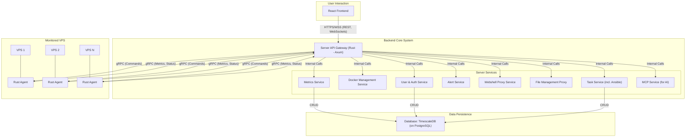

# NodeNexus

## Introduction

This project is a lightweight, high-performance VPS (Virtual Private Server) monitoring and management platform built with Rust and React. It provides a centralized, efficient, and user-friendly interface to monitor multiple VPS instances, execute automated tasks, and manage server resources in real-time.

## Core Features

- **Real-time Performance Monitoring**: Track CPU, memory, disk I/O, and network traffic with live updates.
- **Batch Command Execution**: Concurrently execute commands or predefined scripts across multiple VPS instances with real-time output streaming.
- **Docker Management**: View, start, stop, and manage Docker containers running on your servers.
- **Webshell & File Management**: Access a remote terminal and perform file operations directly from the web UI.
- **Task Automation**: Schedule recurring tasks and integrate with Ansible for complex configuration management.
- **Alerting System**: Define custom alert rules and receive notifications through various channels.
- **AI Assistant Integration**: Interact with the platform using natural language through a dedicated MCP (Model Context Protocol) service.

## Architecture Overview

The platform consists of three main components: a **Frontend** web application, a central **Server**, and a lightweight **Agent** deployed on each monitored VPS.

- **Frontend**: The user interface for data visualization, configuration, and interaction.
- **Server**: The central hub that aggregates data, serves the API, schedules tasks, and manages user authentication.
- **Agent**: A lightweight Rust binary that collects metrics and executes commands on the VPS.
- **Database**: PostgreSQL with the TimescaleDB extension for efficient time-series data storage and querying.

## Tech Stack

- **Backend**: Rust, Axum, Tonic (gRPC), SQLx, Tokio
- **Frontend**: React, TypeScript, Vite, Tailwind CSS, Zustand
- **Database**: PostgreSQL with TimescaleDB
- **Agent**: Rust

## Getting Started

### Prerequisites

- [Rust](https://www.rust-lang.org/tools/install)
- [Node.js](https://nodejs.org/)
- [Docker](https://www.docker.com/get-started)

### Backend Setup

1.  Navigate to the `backend` directory.
2.  Create a `.env` file based on `.env.example` and configure your database connection.
3.  Run `cargo build --release` to build the server.
4.  Run the compiled binary.

### Frontend Setup

1.  Navigate to the `frontend` directory.
2.  Run `npm install` to install dependencies.
3.  Run `npm run dev` to start the development server.

### Agent Deployment

1.  Navigate to the `backend` directory (where the agent code resides).
2.  Build the agent using `cargo build --release --bin agent`.
3.  Copy the compiled agent binary from `target/release/agent` to your target VPS.
4.  Run the agent on the VPS, providing the server address and secret key.

## Deployment

A Docker Compose setup is recommended for production deployment. You can find an example `docker-compose.yml` in the project root, which orchestrates the server, database, and a reverse proxy.

## Contributing

Contributions are welcome! Please follow these steps:

1.  Fork the repository.
2.  Create a new branch (`git checkout -b feature/your-feature-name`).
3.  Make your changes and commit them (`git commit -m 'Add some feature'`).
4.  Push to the branch (`git push origin feature/your-feature-name`).
5.  Open a Pull Request.

## License

This project is licensed under the MIT License. See the [LICENSE](LICENSE) file for details.